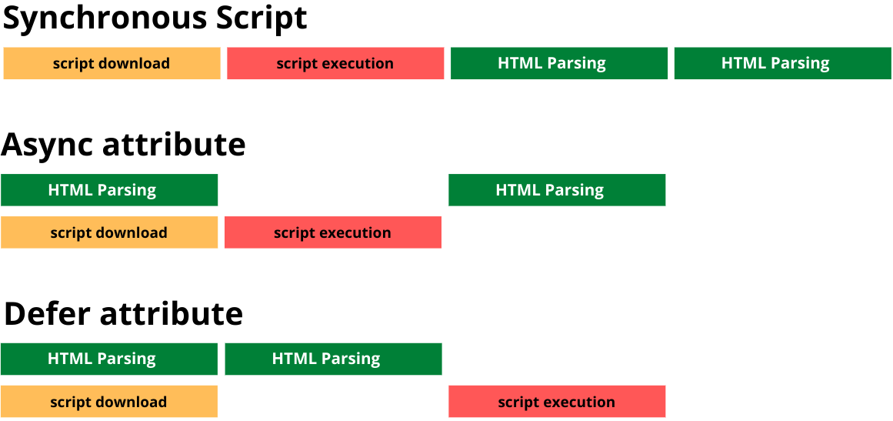

# NOTE -DO NOT WRITE DETAILED ANS JO SIRF ANS NAAM SE HAI YA intvAns NAAME SE WO PAART ANS KA LIKHNA . NOW START 👇🏼👇🏼👇🏼

Q0) What is HTML?

Answer---HTML stands for HyperText Markup Language. It is used to provide structure to web pages by defining elements such as buttons, links, images, and headings. Think of it as the skeleton of a website which is essential for creating any web page. Without HTML, there wouldn’t be any websites
.

---

Q1) What does an HTML document consist of?

Answer ----An HTML document consists of four main parts Doctype Declaration , root element , head element and Body element .

1. **Doctype Declaration**: This declaration defines the document type and version of HTML. It ensures the browser knows to render the page in standards mode.

   ```html
   <!DOCTYPE html>
   ```

2. **Root Element**: The `<html>` tag is the root element that wraps all the content of the HTML document.

   ```html
   <html></html>
   ```

3. **Head Element**: This section includes meta-information about the document, such as:

   - **Title**: The title of the webpage, which appears in the browser tab.
   - **Meta Tags**: Information about the webpage, like character set, author, and description.
   - **Links to Stylesheets**: External CSS files that style the webpage.
   - **Scripts**: JavaScript files that add interactivity to the webpage.

4. **Body Element**: This section contains the actual content of the webpage, such as:
   - **Text**: Paragraphs, headings, and lists.
   - **Images**: Pictures and graphics.
   - **Links**: Hyperlinks to other webpages.
   - **Forms**: Input fields, buttons, and other form elements.
   - **Multimedia**: Videos and audio files.

---

Q2) What are HTML Tags?

Ans -**HTML Tags** are the building blocks of HTML elements. They consist of an opening tag and a closing tag which is used to mark the beginning and end of an HTML element. For example, in the `<p>`(paragraph element) element, `<p>` is the opening tag and `</p>` is the closing tag.

**Note:** Not all HTML tags have closing tags. These are called **self-closing tags** or **void tags**. Examples include the `` tag, `<br>` tag, and `<input>` tag.
These are like that because they do not have any content to it .

Tags that have both opening and closing tags are called **container tags** or **non-void tags**. Examples include `<div></div>`, `<p></p>`, and `<h1></h1>`.

---

Q3) What is the difference between HTML tags and HTML elements?

Ans -Difference Between HTML Tags and HTML Elements

**HTML Tags**:

- HTML Tags consists of an opening tag and a closing tag which is used to mark the beginning and end of an HTML element

**HTML Elements**:

- HTML elements are the complete structure created using both the tags and the content. For example, if we have a paragraph element with the content "hello," Then for this we have an opening tag, content, and a closing tag. This whole together is called an element.

| **Aspect**     | **HTML Tags**                                                                                          | **HTML Elements**                                                               |
| -------------- | ------------------------------------------------------------------------------------------------------ | ------------------------------------------------------------------------------- |
| **Definition** | Tags are the markers used to define the start and end of an element.                                   | HTML elements are the complete structure created by using tags and the content. |
| **Syntax**     | Tags are enclosed in angle brackets. For example, `<p>` is an opening tag and `</p>` is a closing tag. | An element consists of an opening tag, content, and a closing tag.              |
| **Example**    | `<p>` (opening tag) and `</p>` (closing tag)                                                           | `<p>This is a paragraph.</p>`                                                   |

---

Q4) What is Formatting in HTML?

Ans - **HTML Formatting** is the process of enhancing the appearance of text on a webpage to improve its look and feel. In order to do that we have various html tags such

Examples:

- **Italic**: `<i>` or `<em>` _italic is trh_
- **Underline**: `<u>`
- **Bold**: `<b>` or `<strong>`
- **Strikethrough**: `<s>` or `<del>` **kata hua**
- **Subscript**: `<sub>` **H2O (yaha 2 neeche likho yahi subscript hai)**
- **Superscript**: `<sup>` **e=mc2 (yaha 2 upar likho yahi superscript hai)**

---

Q5) How to Create a Hyperlink in HTML?

Ans -HTML provides an anchor tag (`<a>`) to create hyperlinks that link one page to another. The syntax for creating a hyperlink is:

```html
<a href="URL">Link Text</a>
```

These tags can appear in any of the following ways:

- **Unvisited Link**: Displayed as underlined and blue.
- **Visited Link**: Displayed as underlined and purple.
- **Active Link**: Displayed as underlined and red.

---

Q5.1) Does a hyperlink only apply to text?

Ans -No, hyperlinks can be applied to both text and images. The HTML anchor tag (`<a>`) defines a hyperlink that links one page to another. The `href` attribute is the most important attribute of the anchor tag, specifying the URL of the page the link goes to.

```html
<a href="https://www.example.com">
  
</a>
```

Q 6) What are HTML Attributes and how do we use them?

Ans- **HTML Attributes** are special words used inside the opening tag of an HTML element to control the element’s behavior or provide additional information about that element. Attributes typically come in name/value pairs like `name="value"` and are always included in the opening tag.

For example:

```html
<link rel="stylesheet" href="style.css" />
```

Here, `rel` and `href` are attributes that provide extra information about the `<link>` tag, such as what kind of link it is and what its relation is.

---

Q7) What is a Marquee in HTML?

Ans - The **HTML Marquee** element (`<marquee>`) is used to create a scrolling area of text or images on a web page. This element allows content to move horizontally or vertically across the screen, attracting attention or adding dynamic movement to a webpage.

- **Scrolling Text from Left to Right**:
  ```html
  <marquee direction="right">This text will scroll from left to right.</marquee>
  ```
  **Output**: <marquee direction="right">This text will scroll from left to right.</marquee>

## **Note:** The `<marquee>` tag is deprecated in HTML5 and is not recommended for use in modern web development. It is better to use CSS animations for similar effects.

Q8) Which HTML Tag is Used to Display Data in Tabular Form?

Ans - The HTML `<table>` tag is used to display data in a tabular form (rows and columns). It also helps manage the layout of the page, such as the header section, navigation bar, body content, and footer section.

Here is a list of tags used while displaying data in a tabular form:

| **Tag**      | **Description**                                                      |
| ------------ | -------------------------------------------------------------------- |
| `<table>`    | Defines a table.                                                     |
| `<tr>`       | Defines a row in a table.                                            |
| `<th>`       | Defines a header cell in a table.                                    |
| `<td>`       | Defines a cell in a table.                                           |
| `<caption>`  | Defines the table caption.                                           |
| `<colgroup>` | Specifies a group of one or more columns in a table for formatting.  |
| `<col>`      | Used with `<colgroup>` to specify column properties for each column. |
| `<tbody>`    | Groups the body content in a table.                                  |
| `<thead>`    | Groups the header content in a table.                                |
| `<tfoot>`    | Groups the footer content in a table.                                |

### Example of an HTML Table

```html
<!DOCTYPE html>
<html>
  <head>
    <title>HTML Table Example</title>
  </head>
  <body>
    <table border="1">
      <caption>
        Monthly Savings
      </caption>
      <thead>
        <tr>
          <th>Month</th>
          <th>Savings</th>
        </tr>
      </thead>
      <tbody>
        <tr>
          <td>January</td>
          <td>$100</td>
        </tr>
        <tr>
          <td>February</td>
          <td>$80</td>
        </tr>
      </tbody>
      <tfoot>
        <tr>
          <td>Total</td>
          <td>$180</td>
        </tr>
      </tfoot>
    </table>
  </body>
</html>
```

**Output**:

---

**Monthly Savings**

| **Month** | **Savings** |
| --------- | ----------- |
| January   | $100        |
| February  | $80         |
| **Total** | **$180**    |

### Explanation of Example Code

- **DOCTYPE Declaration**: The `<!DOCTYPE html>` declaration defines the document type, which is HTML5 in this case.
- **`<head>`**: This section contains metadata about the document, like its title.
- **`<table>`**: The main tag that creates the table. The `border="1"` attribute adds a border to the table.
- **`<caption>`**: Provides a heading or title to the table ("Monthly Savings" in this case).
- **`<thead>`**: Contains the table header, where `<th>` elements define the column names: "Month" and "Savings."
- **`<tbody>`**: Contains the main body of the table with data rows for "January" and "February."
- **`<tfoot>`**: Contains the footer section, where the total savings are calculated.

---

Q9) What is the `<caption>` Tag ?

Ans - The `<caption>` tag in HTML is used to provide a title or explanation for the data in an HTML table. It must be placed immediately after the `<table>` tag and is typically displayed above the table by default.

---

Q10 ) What are list types in HTML and what are its various types?

IntvAns ---

1. **Ordered List (`<ol>`)**: This type of list is used when the order of items is important. Each item in the list is numbered, and the numbering is automatically handled by the browser. Ordered lists are useful for instructions, steps, or any content that needs to be presented in a specific sequence.

2. **Unordered List (`<ul>`)**: This type of list is used when the order of items is not important. Each item in the list is marked with a bullet point. Unordered lists are commonly used for lists of items where the sequence does not matter, such as a list of features or a shopping list.

3. **Definition List (`<dl>`)**: This type of list is used for defining terms and their descriptions, similar to a dictionary. Each term is defined using the `<dt>` tag, and its description is provided using the `<dd>` tag. Definition lists are useful for glossaries, FAQs, or any content that requires term-definition pairs.

-HTML lists are used to group related items together. They help in organizing content in a structured manner, making it easier for users to read and understand. The three main types of lists in HTML are:

1. **Ordered List**:

   - Displays elements in a numbered format.
   - Represented by the `<ol>` tag.
   - Example:
     ```html
     <ol>
       <li>First item</li>
       <li>Second item</li>
       <li>Third item</li>
     </ol>
     ```

2. **Unordered List**:

   - Displays elements in a bulleted format.
   - Represented by the `<ul>` tag.
   - Example:
     ```html
     <ul>
       <li>First item</li>
       <li>Second item</li>
       <li>Third item</li>
     </ul>
     ```

3. **Definition List**:
   - Displays elements in a definition format, similar to a dictionary.
   - Uses the `<dl>`, `<dt>`, and `<dd>` tags.
   - Example:
     ```html
     <dl>
       <dt>HTML</dt>
       <dd>HyperText Markup Language</dd>
       <dt>CSS</dt>
       <dd>Cascading Style Sheets</dd>
     </dl>
     ```

---

Output of Definition List :-

**HTML**  
&nbsp;&nbsp;&nbsp;&nbsp;HyperText Markup Language

**CSS**  
&nbsp;&nbsp;&nbsp;&nbsp;Cascading Style Sheets

---

---

Q11) What are semantic tags in HTML?Give some example and What are nonSemantic tags give some example

Ans --

### Semantic Tags in HTML

**Semantic tags** in HTML are those tag that clearly describe the meaning of the content they hold .It clearly describe the meaning of the content they hold in a human- and machine-readable way. These tags help both the browser and developers understand the structure and content of a webpage more effectively.

#### Benefits of Semantic Tags:

- Improve SEO (Search Engine Optimization) as search engines can better understand the content.
- Enhance accessibility for screen readers and other assistive technologies.
- Make the HTML code more readable and maintainable.

#### Examples of Semantic Tags: `<header> , <article> ,<aside> <section>,<nav>` etc

### Non-Semantic Tags in HTML

On the other hand **Non-semantic tags**in HTML are those tag that do not convey any meaning of the content they are holding .They are used purely for styling and layout, without specifying what content they are holding.

#### Examples of Non-Semantic Tags are `<div>, <span>` , <b>, <i>(aise bolo div span bold etc) etc.

**Note**: Tags like `<p>`, `<h1>`, etc., are semantic as they provide meaning to the content. Conversely, tags like `<b>`, `<i>`, `<u>`, `<font>`, and `<center>` are non-semantic because they are used purely for styling without specifying any information of the content they are holding .

## Note 2-Semantic tags improve clarity, accessibility, and search engine optimization, while non-semantic tags are more general-purpose containers used for layout and styling.

---

Q12) What is an Image Map in HTML?

intv Ans --
`An Image map in Html is used to display an image on a website in which we want to have multiple clickable areas (hotspots) that lead to different locations or perform various actions. for example - Imagine we have a map of a county and we want to be able to click on the different city and be able to see the details about the city .so for these kind of scenarios we use image Map As using an image inside an anchor tag will not be able to achieve this and only make the entire image clickable and point to only one specific location but the Image Map will not only make it point to different location It also allows for pixel-perfect interaction by defining different shapes (like circles, rectangles, or polygons) for each clickable area, providing precise targeting of the regions on the image.

(very helpful when we have different shape images like shoes and we want to cover the whole image so when user hover on it it becomes clickable making it precise and pixel perfect)`

❌❌❌❌no write detailed❌❌❌❌

#### Detailed Ans --

An **image map** in HTML is an image with clickable areas, known as **hotspots**, that link to different destinations or trigger specific actions when clicked. You can define specific areas on the image to act as links, making different parts of the image interactive.

### How Does an Image Map Work?

1. **Image**: The image is displayed using the `` tag.
2. **Map Definition**: The clickable areas are defined using the `<map>` tag.
3. **Clickable Areas**: The clickable parts of the image (hotspots) are created using the `<area>` tag within the `<map>`.

---

### Step-by-Step Explanation

#### 1. **Add the Image**

First, add the image you want to use in the image map using the `` tag and assign it to a map using the `usemap` attribute.

```html

```

- **`src`**: The source URL of the image.
- **`usemap`**: Associates the image with a map, identified by `#fitnessmap`.

#### 2. **Define the Image Map**

Next, define the map using the `<map>` tag, giving it the same name as the `usemap` reference (`fitnessmap`).

```html
<map name="fitnessmap">
  <!-- Areas will be defined here -->
</map>
```

#### 3. **Create Clickable Areas**

Now, define clickable areas within the map using the `<area>` tag. You need to specify:

- **`shape`**: The shape of the clickable area (e.g., `rect`, `circle`, or `poly` for a polygon).
- **`coords`**: The coordinates that define the clickable area.
- **`href`**: The URL or link that the area will point to.

Example of defining areas:

```html
<map name="fitnessmap">
  <!-- Circular area around the dumbbell -->
  <area
    shape="circle"
    coords="300,180,70"
    href="https://example.com/dumbbells"
    alt="Dumbbells"
  />

  <!-- Rectangular area on the human body -->
  <area
    shape="rect"
    coords="120,40,500,350"
    href="https://example.com/fitness"
    alt="Fitness Body"
  />
</map>
```

- **For the circle**:
  - `coords="300,180,70"` means the center of the circle is at (300, 180) and its radius is 70.
- **For the rectangle**:
  - `coords="120,40,500,350"` means the top-left corner is at (120, 40) and the bottom-right corner is at (500, 350).

---

### Full Example Code

```html
<!DOCTYPE html>
<html lang="en">
  <head>
    <meta charset="UTF-8" />
    <meta name="viewport" content="width=device-width, initial-scale=1.0" />
    <title>Image Map Example</title>
  </head>
  <body>
    <h1>Interactive Image Map</h1>

    <!-- Image with clickable areas -->
    

    <!-- Map definition with clickable areas -->
    <map name="fitnessmap">
      <!-- Circular clickable area for the dumbbells -->
      <area
        shape="circle"
        coords="300,180,70"
        href="https://example.com/dumbbells"
        alt="Dumbbells"
      />

      <!-- Rectangular clickable area for the fitness body -->
      <area
        shape="rect"
        coords="120,40,500,350"
        href="https://example.com/fitness"
        alt="Fitness Body"
      />
    </map>
  </body>
</html>
```

---

### Visual Output Explanation

1. The image will appear on the page.
2. **Clickable Areas**:
   - Clicking on the **dumbbells** part of the image will redirect you to a link about dumbbells (`https://example.com/dumbbells`).
   - Clicking on the **body** part will redirect you to a fitness-related link (`https://example.com/fitness`).

---

### How to Test

- You can copy and paste this HTML code into a `.html` file and open it in a browser.
- When you hover over the specific areas (like the dumbbells or the body), the mouse pointer will change, and clicking those areas will take you to the respective links.

---

### Conclusion

An image map is best used when you have **one image** but want **multiple clickable areas** with different behaviors. It is a great way to create interactive images where clicking on specific parts of the image performs unique actions.

---

---

Q13) How to insert a copyright symbol on a browser page?

## Ans- You can insert a copyright symbol by using `&copy; or &#169;` in an HTML file.

Q14.0) How to create a nested webpage in HTML? or What is use of iframe tag?

Ans - To create a nested webpage in HTML, we use `<iframe>` tag in html . In other words, it represents a webpage within a webpage. The HTML `<iframe >`tag defines an inline frame. For example:

```html
<!DOCTYPE html>
<html>
  <body>
    <h2>HTML Iframes example</h2>
    <p>
      Use the height and width attributes to specify the size of the iframe:
    </p>
    <iframe src="https://www.javatpoint.com/" height="300" width="400"></iframe>
  </body>
</html>
```

Output -- INSIDE our website another website of java point will be there usko scroll kr payenge bs ho gya

---

Q14) How do you keep list elements straight in an HTML file?

IntvAns - In order to keep list elements straight in an HTML file we should use proper tag of which kind of list we are making and should ensure that the list tag is properly enclosed in the type of list tag we are making ex `<ul> , <ol> <dl >` list .
Also in order to add more allignment or styling we can use css .ex flexbox , margin , padding , text-allign .

#### Ans --

To keep list elements organized in HTML:

1. **Use Proper Tags**:
   - `<ol>` for ordered lists, `<ul>` for unordered lists, and `<dl>` for definition lists.
2. **Indentation**:

   - Properly Indent list items using (`<li>`) tag for readability.

3. **Consistent Structure**:

   - Ensure all `<li>` elements are inside `<ol>`, `<ul>`, or `<dl>`.

4. **Nesting Lists**:

   - Properly format nested lists for clarity.

5. **Use CSS**:
   - Style lists (markers, spacing) with CSS for better presentation.

---

Q15) How do you align list elements in an HTML file?

Intv Ans -- We can align list element in an Html file using css for example we can use flexbox to make it align in different ways , also we can use properties like text-align , padding and margint to make allignment more smooth
Ans --
To align list elements in an HTML file, you can use CSS for precise control over alignment and spacing. Here are some common ways to achieve alignment:

1. **Using CSS `list-style-position`**:

   - Controls whether list markers (bullets or numbers) are inside or outside the list items.

   ```css
   ul {
     list-style-position: inside; /* Aligns markers with the list text */
   }
   ```

2. **Using CSS `text-align`**:

   - Aligns the text of list items to the left, right, or center.

   ```css
   ul {
     text-align: center; /* Centers the text */
   }
   ```

3. **Adjusting Indentation**:

   - Use `margin` or `padding` to adjust the indentation of list items.

   ```css
   ul {
     padding-left: 20px; /* Indents the list */
   }
   ```

4. **Flexbox for Custom Alignment**:
   - Use Flexbox for more advanced alignment options.
   ```css
   ul {
     display: flex;
     justify-content: space-between; /* Spreads items evenly */
   }
   ```

---

Q16) What is the difference between an ordered list and an unordered list?

Intv Ans --  
The difference between an ordered list and an unordered list is based on whether the items need to be in a specific order.

- We use an **ordered list** when the order of items matters, such as steps in a process. Each item is automatically numbered or lettered by the browser.
- An **unordered list** is used when the order of items doesn’t matter, and list items are displayed with bullet points by default, without any numbering or specific order.

---

Q17) What is a style sheet?

Ans --  
A **style sheet** is used to add styling to a web page, and it's typically attached to an HTML document using the `<link>` tag. By using a style sheet we can control the appearance of the webpage, including things like colors, fonts, layout, animations and hover effects . It helps make the webpage visually appealing and interactive, ensuring proper alignment and responsiveness across devices.

---

Q18) How do we insert a comment in HTML?

Ans -To insert a comment in an Html file we use an opening angle bracket followed by an exmlamation mark and then two dashes and then again two dashes and a closing angle bracket.

So whatever we write between this `<!-- Your comment here -->`. is treated as comment by HTML and will not be displayed in the browser. Comments are useful for adding notes or explanations in the code that are visible only to developers.

---

Q19) Can you create a multi-colored text on a web page?

Ans -
Yes, we can create multi-colored text on a web page using **CSS**. By applying different **color** properties to specific parts of the text, we can change the color for each portion. This can be done by wrapping different sections of text in `<span>` or `<div>` elements and styling them with CSS.

For example:

```html
<p>
  This is <span style="color:red;">red</span>, this is
  <span style="color:blue;">blue</span>, and this is
  <span style="color:green;">green</span>.
</p>
```

---

Q 20) Is it possible to change the color of the bullet?

Intv Ans --  
Yes, it's possible to change the color of the bullet in several ways:

1. **Using `::marker`**: The `::marker` pseudo-element can be used to directly style the bullet itself. You can apply color, font size, etc.

2. **Using a Custom Bullet Image**: You can replace the default bullet with a custom image, allowing full control over the bullet's appearance.

3. **Using `::before` Pseudo-Element**: You can create your own custom bullet by adding a colored bullet symbol before each list item using `::before`.

4. **Using `text-shadow`**: You can create a colored bullet effect by applying `text-shadow` to the list item. This method makes the text itself transparent and applies a shadow with the desired color to simulate colored bullets.

`Note - Note: The color of the bullet is typically the same as the color of the first text in the list item. Therefore, if you want to change the bullet color, you generally need to change the color of the text as well.`

####For detail answer visit github and understand it clearly

❌❌❌❌no write detailed❌❌❌❌

###Detail Answer ----
Yes, you can change the color of the bullet points in a list using several methods. Here are some ways to do it:

1. **Using `::marker` Pseudo-Element**: The `::marker` pseudo-element allows you to style the bullet points directly.

   ```html
   <!DOCTYPE html>
   <html lang="en">
     <head>
       <meta charset="UTF-8" />
       <meta name="viewport" content="width=device-width, initial-scale=1.0" />
       <title>Change Bullet Color</title>
       <style>
         ul {
           list-style-type: disc; /* Default bullet style */
         }

         ul li::marker {
           color: red; /* Change bullet color to red */
         }
       </style>
     </head>
     <body>
       <ul>
         <li>Item 1</li>
         <li>Item 2</li>
         <li>Item 3</li>
       </ul>
     </body>
   </html>
   ```

2. **Using Custom Bullet Image**: Replace the default bullets with a custom image that has the desired color.

   ```html
   <!DOCTYPE html>
   <html lang="en">
     <head>
       <meta charset="UTF-8" />
       <meta name="viewport" content="width=device-width, initial-scale=1.0" />
       <title>Custom Bullet Image</title>
       <style>
         ul {
           list-style-type: none; /* Remove default bullets */
           padding-left: 0;
         }

         ul li {
           background: url("path-to-your-colored-bullet.png") no-repeat left
             center;
           padding-left: 25px; /* Adjust according to your bullet image size */
         }
       </style>
     </head>
     <body>
       <ul>
         <li>Item 1</li>
         <li>Item 2</li>
         <li>Item 3</li>
       </ul>
     </body>
   </html>
   ```

3. **Using Pseudo-Elements**: Create custom bullets with different colors using the `::before` pseudo-element.

   ```html
   <!DOCTYPE html>
   <html lang="en">
     <head>
       <meta charset="UTF-8" />
       <meta name="viewport" content="width=device-width, initial-scale=1.0" />
       <title>Colored Bullet with Pseudo-Element</title>
       <style>
         ul {
           list-style-type: none; /* Remove default bullets */
           padding-left: 0;
         }

         ul li {
           position: relative;
           padding-left: 20px; /* Space for custom bullet */
         }

         ul li::before {
           content: "•"; /* Bullet character */
           color: red; /* Bullet color */
           position: absolute;
           left: 0;
           top: 0;
         }
       </style>
     </head>
     <body>
       <ul>
         <li>Item 1</li>
         <li>Item 2</li>
         <li>Item 3</li>
       </ul>
     </body>
   </html>
   ```

4. **Using `text-shadow` for Bullet Points**: Apply a text shadow to the bullet points for a colored effect.

   ```html
   <!DOCTYPE html>
   <html lang="en">
     <head>
       <meta charset="UTF-8" />
       <meta name="viewport" content="width=device-width, initial-scale=1.0" />
       <title>Bullet Color with Text Shadow</title>
       <style>
         ul {
           list-style-type: disc; /* Default bullet style */
         }

         ul li {
           color: transparent; /* Hide the text color */
           text-shadow: 0 0 0 red; /* Red shadow creates the bullet color effect */
         }
       </style>
     </head>
     <body>
       <ul>
         <li>Item 1</li>
         <li>Item 2</li>
         <li>Item 3</li>
       </ul>
     </body>
   </html>
   ```

**Note**: The color of the bullet is always the color of the first text of the list. So, if you want to change the color of the bullet, you must change the color of the text. This is why methods like `::marker`, custom bullet images, or pseudo-elements are used to achieve more control over bullet color.

**Additional Example Using Inline CSS:**

```html
<!DOCTYPE html>
<html lang="en">
  <head>
    <meta charset="UTF-8" />
    <meta name="viewport" content="width=device-width, initial-scale=1.0" />
    <title>Change Bullet Color</title>
  </head>
  <body>
    <ul style="list-style-type: disc;">
      <li style="color: red;">Item 1</li>
      <li style="color: red;">Item 2</li>
      <li style="color: red;">Item 3</li>
    </ul>
  </body>
</html>
```

**List Styling:**

- The `<ul>` tag has `style="list-style-type: disc;"` to ensure default bullet styling.
- Each `<li>` tag has `style="color: red;"` to set both the text color and the bullet color to red.

---

Q21) How many tags can be used to separate a section of texts?

Intv Ans --

You can use several tags to separate sections of text, each serving different purposes:

1. **`<br>`**: Inserts a line break within the same block of text.
2. **`<p>`**: Defines a paragraph, creating space above and below itself.
3. **`<h1>`, `<h2>`, etc.**: Defines headings of various levels, adding space and highlighting sections.
4. **`<div>`**: A container for grouping content, typically used with CSS to add spacing.
5. **`<section>`, `<article>`, `<aside>`, `<header>`, `<footer>`, `<nav>`**: Semantic tags that structure content and often add spacing based on CSS.

## **Summary**: Use `<br>` for line breaks, and tags like `<p>`, `<h1>`, and `<div>` for creating distinct sections with spacing.

Q22) How to make a picture a background image of a web page?

INtv Ans -To set a picture as the background of a web page, use background-image property and specify the URL of the image. For example:

```css
body {
  background-image: url("path-to-your-image.jpg");
}
```

---

Q23) What are empty elements?

Intv Ans -- HTML elements that do not contain have any content or closing tags are called empty elements. For example: `<br>, <hr>` etc.

---

Q24) What is the use of a span tag? Give one example.

Intv Ans --  
The `<span>` tag is used to apply styling and JavaScript functionality to a specific part of text within a block of text. For example, if we have a text "Hello beautiful world," and we want to change the color of "beautiful," and make it clickable . So For this we would use span>` tag and apply the style and the onClick method on it .

So in conclusion span tag is an inline element that does not create additional space or line breaks and allows you to modify specific text without affecting the rest of the content .
example:

```html
<span style="color: red;" onclick="alert('Clicked!')">beautiful</span>
```

---

Q25) What are the entities in HTML?

Intv Ans --  
HTML entities are special codes used to display characters that are reserved in HTML or not easily typable. These entities ensure that characters are displayed correctly in the browser without being interpreted as HTML code. For example, `&lt;` represents `<`, and `&amp;` represents `&`.

**Purpose:**

- **Reserved Characters:** Some characters like `<` and `>` are reserved in HTML for defining tags. Entities ensure these characters are displayed correctly.
- **Special Characters:** Entities are also used for characters not easily typed on a keyboard, such as `©` (copyright) or `€` (euro).

---

Q26) Why is a URL encoded in HTML?

#### Intv Ans --

URL encoding, also known as percent encoding, is used to convert characters into a format that can be transmitted over the Internet. This is essential because URLs can only be sent using the ASCII character set, and Since URLs often contain characters that are not part of ASCII set or have characters that have special meanings in HTML (e.g., `/`, `&`, `?`). So these characters need to be converted into a valid ASCII format to prevents issues with URLs being misinterpreted by web servers and browsers . So , The non-ASCII characters are replaced with a "%" followed by hexadecimal digits.
For example, spaces are encoded as `%20`, and special characters like `&` and `?` are converted into `%26` and `%3F` respectively.

---

Q27) Is `<!DOCTYPE html>` an HTML tag?

Intv Ans --  
No, the `<!DOCTYPE html>` declaration is not an HTML tag. It is like an instruction used to inform the browser about which version of Html is being used to render the page like In this case, `<!DOCTYPE html>` specifies that the document is using HTML5.

---

Q28) What is whitespace in HTML?

Intv Ans --  
Whitespace in HTML refers to any space, tab, or line break used to separate elements and content in the code. It helps with the readability of the code but is generally ignored by browsers when rendering the page, meaning multiple spaces or line breaks are treated as a single space.

For example:

```html
Hello world How are you?
```

**Output:**

```
Hello world

How are you?
```

Additional Notes:

- **Non-breaking Space (`&nbsp;`)**: To add a space that will not be collapsed, you can use the non-breaking space entity `&nbsp;`. -**Multiple Line breaks(`<br>`)** : To create multiple line breaks, use multiple <br> tags or apply CSS for spacing.
- **Whitespace Collapse**: Browsers collapse multiple whitespace characters into a single

---

Q29) How do we create links to different sections within the same HTML web page?

Intv Ans --  
To create links to different sections within the same HTML web page, we use an anchor tag (`<a>`) combined with an `id` attribute. This technique is often referred to as creating “anchor links” or “bookmarks.”

In order to do that we add an `id` Attribute to the Target Section where we want to go and then we use the anchor tag and inside its href attribut we write # and its id name to link it to that id section.

here how we do:

1. **Add an `id` Attribute to the Target Section**: Assign a unique `id` to the section you want to link to.
2. **Create a Link to the Target Section**: Use the `href` attribute in an anchor tag with a `#` followed by the `id` value of the target section.

**Example:**

```html
<!DOCTYPE html>
<html lang="en">
  <head>
    <meta charset="UTF-8" />
    <meta name="viewport" content="width=device-width, initial-scale=1.0" />
    <title>Page with Internal Links</title>
  </head>
  <body>
    <!-- Links -->
    <a href="#section1">Go to Section 1</a>

    <!-- Sections -->
    <h2 id="section1">Section 1</h2>
    <p>This is Section 1.</p>
  </body>
</html>
```

In this example, clicking on "Go to Section 1" will scroll the page to the element with `id="section1"`.

---

Q30) Can we create our own HTML tags like creating our name HTML tags? If yes, how and why?

#### Intv Ans --

Yes, we can create our own HTML tags using a concept known as Custom Elements or Web Components. It allows us to define new HTML tags with custom behavior and properties.

**How to Create Custom HTML Tags:**

1. **Define a Custom Element Class**:
   Create a JavaScript class that extends the `HTMLElement` class.

2. **Register the Custom Element**:
   Use the `customElements.define()` method to define your new element and associate it with the class you created.

3. **Use the Custom Element in HTML**:
   Once defined, you can use your custom element just like any other HTML tag.

**Why Use Custom Elements?**

- **Encapsulation**: Encapsulate HTML, CSS, and JavaScript into a single component.
- **Reusability**: Reuse complex functionality or styling across different parts of your application.
- **Maintainability**: Keep related code together, making it easier to manage and update.
- **Abstraction**: Simplify the interface for complex components, making them easier to use and understand.

**Example Code:**

```html
<!DOCTYPE html>
<html lang="en">
  <head>
    <meta charset="UTF-8" />
    <meta name="viewport" content="width=device-width, initial-scale=1.0" />
    <title>Custom HTML Tag</title>
    <style>
      my-element {
        display: block;
        padding: 10px;
        background-color: lightblue;
        border: 1px solid blue;
      }
    </style>
  </head>
  <body>
    <!-- Use the custom element -->
    <my-element>Hello, I'm a custom element!</my-element>

    <script>
      // Define a custom element class
      class MyElement extends HTMLElement {
        constructor() {
          super();
          // Attach a shadow DOM to the element
          const shadow = this.attachShadow({ mode: "open" });
          shadow.innerHTML = `<p>This is a custom element</p>`;
        }
      }

      // Register the custom element
      customElements.define("my-element", MyElement);
    </script>
  </body>
</html>
```

In this example:

- A custom element `<my-element>` is created.
- The element uses shadow DOM to encapsulate its content and styling.

---

Q31) What is the `alt` attribute in HTML?

Intv Ans --  
The `alt` attribute, short for "alternative text," is used in HTML to provide a text description of an image. It is added to the `` tag to describe the content of the image for screen readers and in cases where the image cannot be displayed.

**Purpose:**

- **Accessibility**: Helps visually impaired users understand the content of the image through screen readers.
- **SEO**: Assists search engines in indexing the image content.
- **Fallback**: Provides a textual description when the image fails to load.

**Example:**

```html

```

---

Q 32) How do we add inline style to an HTML element? Give an example by adding color to a heading.

Intv Ans --  
To add inline style to an HTML element, we use the `style` attribute directly within the HTML tag. The `style` attribute allows us to apply CSS styles to the element , using a key-value pair format where the CSS property and value are specified.

**Example:**

```html
<h1 style="color: blue;">This is a blue heading</h1>
```

### Why Use Quotes for Inline Styles?

The CSS properties and values within the `style` attribute are enclosed in quotes to ensure that the entire string is treated as a single attribute value. This is important because the value of the `style` attribute can contain spaces, colons, and semicolons, which are used to separate different CSS properties and values. Enclosing the value in quotes ensures that the browser correctly interprets the entire string as the value of the `style` attribute.

---

Q33)What are the different kinds of Doctypes available?

Intv Ans --  
Doctype declarations are used to specify the version of HTML or XHTML that a document is using. They help browsers render the page correctly. Here are the main types of Doctypes:

1. **HTML5**: The simplest and most modern Doctype, which does not require a reference to a DTD (Document Type Definition). It is used for HTML5 documents.

   ```html
   <!DOCTYPE html>
   ```

2. **HTML 4.01**: Three variations exist, depending on the type of document:

   - **Strict**: No deprecated tags or attributes.
     ```html
     <!DOCTYPE html PUBLIC "-//W3C//DTD HTML 4.01//EN" "http://www.w3.org/TR/html4/strict.dtd">
     ```
   - **Transitional**: Allows deprecated tags and attributes for backward compatibility.
     ```html
     <!DOCTYPE html PUBLIC "-//W3C//DTD HTML 4.01 Transitional//EN" "http://www.w3.org/TR/html4/loose.dtd">
     ```
   - **Frameset**: Used for documents that use frames.
     ```html
     <!DOCTYPE html PUBLIC "-//W3C//DTD HTML 4.01 Frameset//EN" "http://www.w3.org/TR/html4/frameset.dtd">
     ```

3. **XHTML 1.0**: Also has three variations, similar to HTML 4.01:
   - **Strict**: No deprecated elements or attributes.
     ```html
     <!DOCTYPE html PUBLIC "-//W3C//DTD XHTML 1.0 Strict//EN" "http://www.w3.org/TR/xhtml1/DTD/xhtml1-strict.dtd">
     ```
   - **Transitional**: Allows deprecated elements and attributes.
     ```html
     <!DOCTYPE html PUBLIC "-//W3C//DTD XHTML 1.0 Transitional//EN" "http://www.w3.org/TR/xhtml1/DTD/xhtml1-transitional.dtd">
     ```
   - **Frameset**: Used for documents with frames.
     ```html
     <!DOCTYPE html PUBLIC "-//W3C//DTD XHTML 1.0 Frameset//EN" "http://www.w3.org/TR/xhtml1/DTD/xhtml1-frameset.dtd">
     ```

---

Q34) What are the different ways to add styling in HTML? Give all the three ways.

Intv Ans --  
There are three primary ways to add styling to HTML documents:

1. **Inline Styling**: Apply styles directly within an HTML element using the `style` attribute.

2. **Internal Styling**: Define styles within a `<style>` tag in the `<head>` section of the HTML document.

3. **External Styling**: Link to an external CSS file using the `<link>` tag in the `<head>` section of the HTML document. `<link rel="stylesheet" href="styles.css">`

In CSS, the hierarchy or specificity of styles determines which styles are applied when multiple styles are applied to the same element. so the **Specificity Ordering** is that Inline styles have the highest specificity, followed by internal styles, and then external styles.

---

Q35) What is the differenece between an "attribute" and a "property" on HTMl?

Intv Ans --  
In HTML, attributes and properties represent different aspects of elements:

1. **Attribute**:

   - **Definition**: An attribute is a part of the HTML element's markup. It provides additional information about an element and is defined within the opening tag.
   - **Example**: `<input type="text" value="Hello">`

2. **Property**:

   - **Definition**: A property is a value that can be accessed or modified through JavaScript. It represents the current state or value of an element and reflects changes made by JavaScript.
   - **Usage**: It is use to reflect the current state of the element, such as `value` for input elements, `textContent` for text, etc.

   - **Example**: `document.querySelector('input').value = 'World';`

**Key Difference**: Attributes define initial values or settings in the HTML markup, while properties represent the current state or value of an element in the DOM, which can change dynamically.

---

Q36) What is the purpose of the 'doctype' declaration in HTML documents?what will happen if it is not present there?

Intv Ans --  
The `<!DOCTYPE>` declaration serves as an instruction to the browser about which version of HTML or XHTML is being used to render the page.
For example, `<!DOCTYPE html>` specifies that the document is using HTML5.
It is not an HTML tag but an instruction placed at the start of the HTML document to ensure the browser renders the page correctly.
Without it, browsers may render the page in "quirks mode," leading to inconsistent display across different browsers.

In summary, the doctype declaration is a critical component of HTML documents that specifies the version of HTML or XHTML being used, ensuring consistent rendering and adherence to web standards across various browsers and platforms.

---

Q37) What are the differences between block elements, inline elements, and inline-block elements?

#### Intv Ans --

In HTML, elements can have different display properties such as block, inline, and inline-block.

1. **Block Elements**:

   - Block elements are those elements that take up the full width available and always start on a new line. They stack vertically, taking up the entire width of their parent container.
   - You can control dimensions (width, height), margins, and padding for block elements.
   - **Use case**: These elements are basically used for structuring and creating layout of a webpage like sections, headers, or footers.
   - **Examples** of block elements are : `<div>`, `<p>`, `heading tag` etc.

2. **Inline Elements**:

   - On the other hand Inline elements only take up as much width as their content requires, and they do not start on a new line. and flow within the same line.
   - They only respect horizontal dimensions like padding and margins, but vertical dimensions (height) are ignored and when we give them veritcal padding or margin it will not affect the elements height , instead it might cause them to overlap with adjacent lines of text .(HEIGHT property set krenge toh bhi koi fayda nahi seedha ignore hoga )

   - **Use case**: Inline elements are Used for smaller content within block-level elements like links or text styling.
   - **Examples**: `<span>`, `<a>`, `<strong>`, `<em>` etc.

3. **Inline-block Elements**:
   - Inline-block elements are like inline elements in that they do not start on a new line, but they behave like block elements in that you can set width, height, padding, and margins for them.
   - **Use case**: These are Used for navigation menus, buttons, or elements that need to be horizontally aligned while still having block-like properties (width/height).
   - **Examples**: `<button>`, `<select>`, `<meter>`, `<progress>`, `<marquee>`, `<textarea>`, `<input>`.---

---

Q 38) How does the browser load HTML and JavaScript files upon visiting a particular website?

#### Intv Ans --

When you visit a website, the browser follows a structured process to load and display the page, along with any associated JavaScript files.

1. **DNS Lookup**: The browser first performs a DNS lookup to find the server's IP address by resolving the domain name (e.g., www.example.com).

2. **HTTP Request**: Once the IP is found, the browser sends an HTTP or HTTPS request to the server asking for the HTML file of the page.

3. **HTML Parsing**: After receiving the HTML file, the browser starts parsing the HTML content from top to bottom. As it reads through the HTML:

   - If it encounters **CSS** links (`<link>`), it sends additional requests to fetch the external CSS files.
   - If it finds **JavaScript** files (`<script>`), it pauses HTML parsing, downloads, and executes the JavaScript (unless it has attributes like `async` or `defer`).

4. **DOM Construction**: While parsing the HTML, the browser builds the **Document Object Model (DOM)**, representing the page structure in memory.

5. **CSSOM Construction**: The browser also builds the **CSS Object Model (CSSOM)**, which maps styles to elements based on the CSS it loaded.

6. **JavaScript Execution**: If the browser encounters any JavaScript during parsing, it executes it in the order it is found (unless deferred or asynchronous). If it's modifying the DOM, it alters the current structure.

7. **Render Tree & Layout**: Once both the DOM and CSSOM are built, the browser creates the **Render Tree**, determining the layout and styling of each element.

8. **Painting**: Finally, the browser renders the page, painting the pixels on the screen for the user to view the content.
   The updated additional notes look good and provide a clear explanation of the `async` and `defer` attributes in JavaScript. They effectively communicate how these attributes help manage script loading and execution to ensure a smoother user experience. Here’s how they appear:

---

#### Additional Notes:

- **Async and Defer**: JavaScript can block rendering, so the `async` and `defer` attributes are used to load scripts without blocking the parsing of the HTML.
  - `async`: Fetches the script asynchronously in the background along with HTML parsing, and executes it as soon as it is fetched, without waiting for the rest of the HTML to be parsed.
  - `defer`: Fetches the script in the background while HTML parsing is ongoing, but executes the script only after the HTML is completely parsed.

This step-by-step process ensures that the browser can load, parse, and display both HTML and JavaScript efficiently for a smooth user experience.

---

Q39) What is the difference between HTML and DOM ?

IntvAns--- The difference between **HTML** and the **DOM** lies in what they represent and how they function.

**HTML** (HyperText Markup Language) is the code that we write to create the structure and content of a webpage. It defines elements like headings, paragraphs, images, links, etc., using tags. HTML is static and represents the raw content of the webpage.

**DOM** (Document Object Model), on the other hand, is an in-memory representation of the webpage, : It is the structure which is created by the browser after it reads the HTML, and it can be changed dynamically using JavaScript. Like Using JavaScript We can add, remove, or modify elements and manipulate the content, structure, and style of the webpage in the DOM even after the page is loaded.

## So ,In short, **HTML** is the code, while the **DOM** is the structure that the browser creates after it reads the HTML and allows you to interact with via JavaScript.

(NOTE -- **do not write in copy detailed notes**)
DetailedAns ---Let's break down the difference between **DOM (Document Object Model)** and **HTML** step by step, along with examples:

### 1. **What is HTML?**

- **HTML** stands for **HyperText Markup Language**.
- It is the language used to create and structure web pages.
- HTML defines the structure and content of a webpage using elements like `<div>`, `<h1>`, `<p>`, `<a>`, etc.

**Example:**

```html
<html>
  <head>
    <title>My Web Page</title>
  </head>
  <body>
    <h1>Welcome to My Website</h1>
    <p>This is a paragraph of text on my website.</p>
  </body>
</html>
```

- Here, the HTML defines the **static structure** of the webpage. It's what the browser reads first.

### 2. **What is the DOM?**

- The **DOM (Document Object Model)** is a **programmatic representation** of the HTML document.
- It allows **JavaScript** and other programming languages to interact with the webpage.
- After the browser loads the HTML, it creates a **DOM** that mirrors the structure of the HTML. This DOM is an **object** that can be accessed and modified.

**Example:**
When the browser reads the HTML example above, it creates a DOM like this:

```javascript
document
  └── <html>
        ├── <head>
        │     └── <title>My Web Page</title>
        └── <body>
              ├── <h1>Welcome to My Website</h1>
              └── <p>This is a paragraph of text on my website.</p>
```

### 3. **Key Difference Between HTML and DOM**

- **HTML is the static markup**: It is the code written by developers that is displayed by the browser.
- **DOM is the dynamic representation**: It is the structure created by the browser after it reads the HTML, and it can be changed dynamically using JavaScript.

### 4. **How DOM Works with JavaScript**

- JavaScript can manipulate the DOM, meaning it can add, remove, or modify elements and attributes in real-time.

**Example:**
Let's say you have this HTML:

```html
<p id="text">Hello, World!</p>
<button onclick="changeText()">Change Text</button>
```

Using JavaScript, you can manipulate the DOM to change the content:

```javascript
function changeText() {
  document.getElementById("text").innerHTML = "Text Changed!";
}
```

In this case, JavaScript accesses the **DOM** (not the original HTML) to change the content of the `<p>` tag.

### 5. **Summary of the Difference**

- **HTML**: The code you write to structure and display content on a webpage.
- **DOM**: The representation of the HTML structure that the browser creates and allows you to interact with via JavaScript.

---

Q40) How many HTTP request for the above index.html page will result in ?

Ans ---

```html
<!DOCTYPE html>
<html lang="en">
  <head>
    <link rel="stylesheet" href="styles.css" />
    <title>Learning By Doing!</title>
  </head>

  <body>
    <h1>Learn By Doing</h1>
    
    <script src="script.js"></script>
  </body>
</html>
```

1)An HTTP request for the above index.html page will result in at least 3 other HTTP requests which are for fetching

```html
styles.css i.e <link rel="stylesheet" href="styles.css" /> Img.jpg i.e
 script.js i.e
<script src="script.js"></script>
```

---

Q 41) What is SVG in HTML?

**Answer:**

**SVG** stands for **Scalable Vector Graphics**, and it is a language for describing 2D graphics in XML format. In HTML, SVG is used to define vector-based graphics directly within the webpage, allowing for images that can scale infinitely without losing quality, unlike raster images (like JPEG or PNG) that become pixelated when resized.

SVGs are ideal for icons, logos, charts, and illustrations because they remain sharp at any size. SVG elements can also be styled with CSS and manipulated with JavaScript, making them interactive and customizable.

In short, **SVG** in HTML is used to create high-quality, scalable graphics that can be controlled through CSS and JavaScript.

example :--

```html
<svg width="100" height="100">
  <circle cx="50" cy="50" r="40" stroke="yellow" stroke-width="4" fill="red" />
</svg>
```

---

Q42) What are the differences between HTML and HTML5?

**Interview Answer:**

HTML and HTML5 are both markup languages used for creating web pages. The main difference between HTML and HTML5 is that HTML5 is the latest version and comes with several new features and improvements compared to the older version.

1. **Semantic Tags**: First HTML5 introduced semantic tags like `<header>`, `<footer>`, `<section>`, and `<article>`, which provide better structure to web pages. Earlier versions of HTML did not have these tags, and developers had to use `<div>` for everything.

2. **APIs and DOM**: Secondly HTML5 introduced new APIs and features like Geolocation, and even lets us draw graphics directly on the page with the <canvas> element. These were not available in earlier versions.

3. **Multimedia Support**: Another big improvement is In HTML5, you can now embed audio and video directly using the `<audio>` and `<video>` tags, while in older versions, you needed external plugins like Flash.

4. **Simplified DOCTYPE**: HTML5 also made the `DOCTYPE declaration` much simpler .Before it was long and complicated but now its just `<!DOCTYPE html>`, making it easier to write.

5. **New Attributes**:
   Lastly, HTML5 introduced new `attributes` like `charset` , for specifying character encoding, and async, attribute which helps control how scripts are loaded, both of which are improvements over the older versions.

So overall, HTML5 provides a more efficient and modern way to build web pages, making it much better suited for today's web development needs.

---

**Q43): What is the display property? What are some display properties?**

**IntvAns:**  
The `display` property in CSS determines how an HTML element is rendered on the web page. It defines the layout behavior of an element, such as whether it takes up the full width of its container, flows with the text, or aligns with other elements.

**Common display properties:**

1. **`block`**  
   Elements with `display: block;` take up the full width of their container, start on a new line, and stack vertically. Example: `<div>`, `<p>`, `<h1>`.

2. **`inline`**  
   Elements with `display: inline;` only take up as much width as necessary, do not start on a new line, and flow with the surrounding text. Example: `<span>`, `<a>`, `<strong>`.

3. **`inline-block`**  
   Elements with `display: inline-block` behave like inline elements but can have dimensions (width, height) like block elements. Example: `<button>`, `<input>`, `<select>`.

4. **`none`**  
   Elements with `display: none;` are not rendered on the page and take up no space. This is often used to hide elements completely.

5. **`flex`**  
   Elements with `display: flex;` create flexible layouts where child elements can be aligned and distributed within a container. It enables horizontal and vertical alignment control. Example: Used in layouts like navigation bars and grids.

6. **`grid`**  
   Elements with `display: grid;` use a grid-based layout system, allowing for precise control of rows and columns. Example: Creating multi-column layouts.

7. **`inline-flex`**  
   Similar to `flex`, but the element itself remains inline, meaning it doesn't start on a new line. It is often used for horizontally aligned elements within a line of text.

**Less common display properties:**

1. **`table`**  
   Renders an element as a block-level table, similar to `<table>`. Often used for layout structures.

2. **`inline-table`**  
   Similar to `table`, but behaves as an inline element.

3. **`table-cell`, `table-row`, `table-column`**  
   Renders an element like a `<td>`, `<tr>`, or `<col>`, respectively, allowing the creation of table-like layouts without actual table tags.

4. **`list-item`**  
   Renders an element as a list item, typically with a bullet or number, as seen in `<li>` elements.

5. **`inherit`, `initial`**  
   `inherit` sets the element to use its parent’s display property, while `initial` resets it to the default display value.

6. **`table-caption`**  
   Renders an element as a caption for a table, often used within `<table>` structures.

## These display properties offer various ways to control the layout and visibility of elements on a webpage, providing flexibility in design and structure.

---

Q 44)How do you write the HTML boilerplate, and what are the key components included in it, including linking external CSS, JavaScript, and a favicon?

Ans ---Here's the updated HTML boilerplate with comments and notes on how to include JavaScript, a favicon, and an external CSS file:

```html
<!DOCTYPE html>
<!-- This signifies that you are using HTML5 version. 
     DOCTYPE should always be at the top of the document. -->

<html lang="en">
  <!-- The root tag of the HTML document. The 'lang' attribute specifies the language of the document. -->

  <head>
    <!-- The head tag contains meta-information about the document, such as links to stylesheets, meta tags, and the title. -->

    <meta charset="UTF-8" />
    <!-- Specifies the character encoding for the HTML document. UTF-8 is a common character encoding. -->

    <meta name="viewport" content="width=device-width, initial-scale=1.0" />
    <!-- Ensures the webpage is responsive and sets the width of the viewport to the width of the device. -->

    <meta http-equiv="X-UA-Compatible" content="ie=edge" />
    <!-- Provides compatibility with Internet Explorer. -->

    <title>Document Title</title>
    <!-- The title tag sets the title of the webpage, which appears in the browser tab. -->

    <link rel="stylesheet" href="styles.css" />
    <!-- Link to an external CSS file for styling the document. -->

    <link rel="icon" href="favicon.ico" type="image/x-icon" />
    <!-- Link to a favicon for the webpage. -->

    <style>
      /* Internal CSS can be included here to style the document. */
    </style>

    <script src="script.js" defer></script>
    <!-- Link to an external JavaScript file. The 'defer' attribute ensures the script is executed after the HTML is fully parsed. -->
  </head>

  <body>
    <!-- The body tag contains the content of the HTML document, such as text, images, links, and other elements. -->
  </body>
</html>
```

### Key Components:

1. **`<!DOCTYPE html>`**: Declares the document type and version (HTML5).
2. **`<html lang="en">`**: The root element of the HTML document, with the `lang` attribute specifying the language.
3. **`<head>`**: Contains meta-information about the document.
   - **`<meta charset="UTF-8">`**: Specifies the character encoding.
   - **`<meta name="viewport" content="width=device-width, initial-scale=1.0">`**: Ensures responsiveness.
   - **`<meta http-equiv="X-UA-Compatible" content="ie=edge">`**: Provides compatibility with Internet Explorer.
   - **`<title>`**: Sets the title of the webpage.
   - **`<link rel="stylesheet" href="styles.css">`**: Links to an external CSS file for styling.
   - **`<link rel="icon" href="favicon.ico" type="image/x-icon">`**: Links to a favicon for the webpage.
   - **`<style>`**: (Optional) Contains internal CSS for styling.
   - **`<script src="script.js" defer></script>`**: Links to an external JavaScript file. The `defer` attribute ensures the script is executed after the HTML is fully parsed.
4. **`<body>`**: Contains the content of the HTML document.

### Additional Notes:

- **External CSS**: Use the `<link>` tag to link to an external CSS file for styling your document.
- **Favicon**: Use the `<link>` tag to link to a favicon, which is the small icon displayed in the browser tab.
- **JavaScript**: Use the `<script>` tag to link to an external JavaScript file. The `defer` attribute ensures the script runs after the HTML is fully loaded.

---

Q44.1)Explain the layout of HTML?

Ans --- HTML layout specifies how our html document is structured using the elements. and every
HTML document have certain elements which are used to define the different parts of our webpage such as.

`<header>`: It is used to define a header for a document or a section.

`<nav>`: It is used to define a container for navigation links

`<section>`: It is used to define a section in a document

`<article>`: It is used to define an independent, self-contained article

`<aside>`: It is used to define content aside from the content (like a sidebar)

`<footer>`: It is used to define a footer for a document or a section

---

Q 45) What are dead links ?

Ans-- **Answer:**

In HTML, _dead links_ refer to hyperlinks that do not lead to any valid destination. Typically, they are used as placeholders or temporary links when the actual target URL is not yet available. A dead link often has an empty `href` attribute (`href="#"`) or uses a dummy value like `javascript:void(0)` to prevent the page from reloading.

### Code Examples:

1. **Using `href="#"`:**

   ```html
   <a href="#">Click Here</a>
   ```

- This link will scroll to the top of the page if clicked. It’s considered a dead link because it doesn't navigate to a new URL.

2. **Using `javascript:void(0)`:**
   ```html
   <a href="javascript:void(0)">Click Here</a>
   ```
   - This method prevents any default action (like page reload) when the link is clicked.

Dead links are useful during development or when designing a layout where the final link destinations are not yet determined.

---

**Q46) How can you create a dead link that does not point to any resource or page if leaving the `href` attribute blank is not allowed? What is the benefit of using a dead link?**

**Ans:** To create a dead link, use `"#"` as the `href` value. This will make the link clickable but will not direct the user to a different page or resource. Instead, clicking the link may cause the page to scroll to the top.

Example:

```html
<a href="#">This is a dead link</a>
```

**Benefits of Dead Links:**

- **Placeholder for Future Links:** Dead links can be used as placeholders when the destination URL is not yet known or decided. This allows developers to maintain the structure of the webpage while working on other parts of the project.
- **Prevents Broken Links:** Using a dead link (`href="#"`) prevents broken links that could confuse users or lead to error pages.
- **Navigational Use:** In some cases, clicking a dead link that uses `href="#"` will scroll the webpage back to the top, which can be a useful navigational feature.

---

Q 47) What is the difference between div and span in HTML?

**Answer:**

The `<div>` and `<span>` elements are both commonly used in HTML for grouping and structuring content, but they serve different purposes and have different characteristics:

1. **`<div>` (Division) Element:**

   - The `<div>` element is a block-level container used to group larger sections of content or elements. for example in case of structuring and styling somethings todgether
   - It takes up the full width available and starts on a new line, pushing the following content down.
   - Commonly used for layout purposes and to structure content in a webpage (e.g., wrapping text, images, or other elements).
   - It can be styled using CSS to control layout properties like width, height, background color, etc.

   **Example:**

   ```html
   <div class="container">
     <h1>Welcome to My Website</h1>
     <p>This is a paragraph inside a div element.</p>
   </div>
   ```

2. **`<span>` Element:**

   - The `<span>` element is an inline container used to group smaller chunks of text or elements inside block elements like a small text in a paragraph .
   - It does not start on a new line and only takes up as much width as necessary.
   - It is typically used to apply specific styles to a small portion of text or inline elements.
   - Useful for adding styles, colors, or special formatting without affecting the overall layout.

   **Example:**

   ```html
   <p>
     This is a <span class="highlight">highlighted</span> word in the sentence.
   </p>
   ```

### Key Differences:

- **Display Type:** `<div>` is block-level, while `<span>` is inline.
- **Usage:** `<div>` is used for larger sections and layouts, whereas `<span>` is used for styling small pieces of content within a block.
- **Layout Impact:** `<div>` starts a new line, while `<span>` stays within the line of text.

---

Q 48) what is a meta tag in Html?
**IntvAns:**
A meta tag is used to provide metadata, or additional information, about an HTML document. It helps specify details like the character encoding being used, viewport settings for responsive design, and other data such as the page's description for search engines.

For example:

- Specifying character encoding:
  ```html
  <meta charset="UTF-8" />
  ```
- Setting viewport width for responsive design:
  ```html
  <meta name="viewport" content="width=device-width, initial-scale=1.0" />
  ```
- Adding a page description for SEO:
  ```html
  <meta
    name="description"
    content="This page explains the usage of meta tags in HTML."
  />
  ```

The meta tag is placed inside the `<head>` section of an HTML document and is essential for optimizing the document's behavior and appearance across different devices and search engines.

---

**Answer:**---

A `<meta>` tag in HTML is used to provide metadata about the web page. Metadata is information that helps describe the content of the page but is not displayed directly on the webpage itself. Instead, it is used by browsers, search engines, and other web services to understand the page's content better.

### Common Uses of `<meta>` Tags:

1. **Character Encoding:** Specifies the character set used in the document.

   ```html
   <meta charset="UTF-8" />
   ```

2. **Viewport Settings:** Helps make the webpage responsive on different devices by controlling the layout.

   ```html
   <meta name="viewport" content="width=device-width, initial-scale=1.0" />
   ```

3. **SEO (Search Engine Optimization):** Provides a description of the page that search engines can use in search results.

   ```html
   <meta
     name="description"
     content="This is a sample webpage for learning HTML meta tags."
   />
   ```

4. **Author Information:** Specifies the author of the webpage.

   ```html
   <meta name="author" content="John Doe" />
   ```

5. **Refresh or Redirect:** Can automatically refresh the page or redirect to another URL after a set time.
   ```html
   <meta http-equiv="refresh" content="30" />
   ```

### Key Characteristics:

- The `<meta>` tag is a self-closing tag and placed inside the `<head>` section of an HTML document.
- It plays an important role in improving search engine visibility, controlling browser behavior, and enhancing the user experience.

---

Q 49)What are the 5 types of meta tags?What are the advantages of it ?

**IntvAns:**

Here are five types of meta tags along with examples:

1. **Character Set Meta Tag:**

   ```html
   <meta charset="UTF-8" />
   ```

   This tag defines the character encoding for the HTML document, ensuring that special characters are displayed correctly.

2. **Viewport Meta Tag:**

   ```html
   <meta name="viewport" content="width=device-width, initial-scale=1.0" />
   ```

   This tag controls the layout on mobile browsers, helping to ensure a responsive design.

3. **Description Meta Tag:**

   ```html
   <meta
     name="description"
     content="This is a brief description of the webpage."
   />
   ```

   This provides a summary of the page content, which search engines often display in search results.

4. **Keywords Meta Tag:**

   ```html
   <meta name="keywords" content="HTML, CSS, JavaScript" />
   ```

   This tag lists important keywords related to the webpage, which can help with SEO.

5. **Author Meta Tag:**
   ```html
   <meta name="author" content="Your Name" />
   ```
   This specifies the author of the webpage, providing credit to the content creator.

**Advantages of Meta Tags:**

1. **SEO Improvement:** Meta tags, especially the meta tag used for description and keywords, helps in improving the page's search engine ranking.

2. **Enhanced User Experience:** The viewport meta tag ensures that your website looks good on all devices, enhancing user experience.

3. **Clear Content Purpose:** The description tag helps users understand what your page is about before they click on it, which can increase click-through rates.

4. **Character Encoding:** using character encoding inside meta tage we can Prevent display issues for international users by specifying the character set.

5. **Content Attribution:** The author tag gives credit to content creators, which can be important for copyright and recognition.

---

Q50). What are forms in HTML and how do you use them? How to create forms in HTML?

Ans--------
In HTML, forms are used to collect user input. They are essential for creating interactive web applications where data can be submitted to a server for processing, such as login pages, sign-up forms, and surveys. Forms consist of input elements like text fields, checkboxes, radio buttons, and submit buttons that allow users to enter and send information.

### How to Use Forms in HTML

- Forms are defined using the `<form>` element, which acts as a container for input elements.
- The `action` attribute specifies the URL where the form data should be sent.
- and The `method` attribute defines the HTTP method (`GET` or `POST`) for sending the data.

### Creating Forms in HTML

Here's how to create a basic form:

```html
<!-- Form starts here -->
<form action="/submit-form" method="POST">
  <!-- Text input field -->
  <label for="username">Username:</label>
  <input type="text" id="username" name="username" required />

  <!-- Password input field -->
  <label for="password">Password:</label>
  <input type="password" id="password" name="password" required />

  <!-- Checkbox -->
  <label for="subscribe">
    <input type="checkbox" id="subscribe" name="subscribe" />
    Subscribe to newsletter
  </label>

  <!-- Radio buttons -->
  <p>Gender:</p>
  <label for="male">
    <input type="radio" id="male" name="gender" value="male" />
    Male
  </label>
  <label for="female">
    <input type="radio" id="female" name="gender" value="female" />
    Female
  </label>

  <!-- Submit button -->
  <button type="submit">Submit</button>
</form>
```

### Key Points:

1. **`<form>` Element:** Acts as a container for input fields and has attributes like `action` and `method` for form submission.
2. **Input Fields:** Include different types such as:
   - `<input type="text">` for text input
   - `<input type="password">` for passwords
   - `<input type="checkbox">` for checkboxes
   - `<input type="radio">` for radio buttons
3. **Labels:** `<label>` tags improve accessibility by associating text with input elements.
4. **Submit Button:** `<button type="submit">` sends the form data to the server.

Forms can be customized further using CSS and JavaScript for validation and interactivity.

---

Q51) What are table, tr, th, td elements? What are table advantages and disadvantages?

**IntvAns:**

The `<table>`, `<tr>`, `<th>`, and `<td>` elements in HTML are used to create and display tabular data in html.

1. **`<table>`**: This element is used to create a table. It acts as a container for all the rows and cells.
2. **`<tr>`** (Table Row): Represents a row in the table. It contains table header or data cells.
3. **`<th>`** (Table Header): Used for creating a header cell in a table. It usually appears bold and centered.
4. **`<td>`** (Table Data): Represents a standard data cell in a table.

**Advantages of using tables:**

- **Organizes data**: Tables make it easy to present data in a structured, grid-like format.
- **Accessibility**: Screen readers can navigate tables more effectively, making them useful for data presentation.
- **Easy styling**: CSS can be used to style table elements for a cleaner appearance.

**Disadvantages of using tables:**

- **Not suitable for layout**: Tables were used in the past for layout, but this is not recommended because it makes the markup complex and difficult to maintain.
- **Responsive design issues**: Tables can be challenging to display on small screens.
- **Slower page loading**: Large tables can slow down page rendering, especially on mobile devices.

---

Q52) What is the title tag in HTML? What are the 4 advantages of the title tag?

**IntvAns:**

The `<title>` tag in HTML defines the title of a web page, and it’s placed in the `<head>` section of the document. This title appears in the browser’s title bar or tab and is crucial for both users and search engines.

There are several advantages of the title tag. First, it plays a significant role in search engine optimization, helping search engines understand the content of the page and improve its ranking. Second, a clear and descriptive title enhances user experience by helping visitors quickly grasp what the page is about before they click on it.

Third, the title tag is important for bookmarking and sharing; it’s often used as the default text when users save or share a link. Finally, it helps in organizing browser tabs, making it easier for users to navigate between multiple open tabs.

---

Q53) How many types of inline tags are there bcause IMG is an inline element but it can have height and width as height and width cannot be given to HTML elements?

Ans -- Inline elements can be categorized into two main types based on their behavior concerning dimensions:(THAT'S why we can specify height and width in img tag)

**IntvAns:**

In HTML, we have different types of inline elements that are inline replace element and inline non -replaced elements,
For example, `<span>` is an inline non-replaced element, which means it cannot have width and height properties applied to it and relies on the content it contains. On the other hand, the `` element is a replaced element, which means we can specify its dimensions using the `width` and `height` attributes .

---

### 1. **Inline Replaced Elements**

These elements can have their dimensions defined explicitly, allowing for the use of width and height properties. They replace their content with external resources. Examples include:

- **``** - Images
- **`<input>`** - Input fields (like text boxes, checkboxes)
- **`<textarea>`** - Multi-line text input fields
- **`<video>`** - Video elements
- **`<audio>`** - Audio elements
- **`<object>`** - External resources like Flash content

**Characteristics:**

- Dimensions can be defined using CSS or HTML attributes.
- They replace the content area with their own content (like an image or video).

### 2. **Inline Non-Replaced Elements**

These elements do not have their own dimensions, and their size is determined by the content inside them. Examples include:

- **`<span>`** - Generic inline container
- **`<a>`** - Anchor (hyperlink)
- **`<strong>`** - Strong importance (usually bold)
- **`<em>`** - Emphasized text (usually italic)
- **`<b>`** - Bold text
- **`<i>`** - Italic text

**Characteristics:**

- Dimensions cannot be explicitly defined.
- Their size depends on the content and any applied styles (like padding or margin).

---

Q54) What are the roles and uses of the div element in Html?

**Answer:** ---- The `<div>` element in HTML is used to group and structure content on a webpage. It doesn't carry any specific meaning by itself, but it acts as a versatile container for organizing content and applying styles through CSS.

Using `<div>`, you can group elements together to structure sections of the page and apply the same styling to all of them. For example, if you have a `<div>` containing three headings, you can easily style all the headings at once by targeting the `<div>` with a CSS rule. This makes `<div>` an essential tool for layout design, styling, and organizing content consistently.

NOte - HTML tags are not case sensitive but it is recommend to use lowercase element names

---

Q55)What are selectors and how many types of seletors are there ??

Ans

### Interview Answer:

**Selectors** in CSS are patterns used to target and style HTML elements based on their attributes, position, or other characteristics. They help in applying styles to specific elements on a webpage.

There are several types of selectors in CSS, and they can be grouped into different categories:

1. **Basic Selectors:**

   - **Universal Selector (`*`)**: Selects all elements.
     ```css
     * {
       color: blue;
     }
     ```
   - **Tag/Element Selector (`element`)**: Selects all elements of a given type (e.g., `p`, `h1`).
     ```css
     p {
       font-size: 16px;
     }
     ```
   - **Class Selector (`.classname`)**: Selects elements with a specified class.
     ```css
     .highlight {
       background-color: yellow;
     }
     ```
   - **ID Selector (`#idname`)**: Selects the element with a specific ID.
     ```css
     #header {
       font-weight: bold;
     }
     ```
   - **Attribute Selector (`[attribute]`)**: Selects elements with a specific attribute.
     ```css
     [type="text"] {
       border: 1px solid black;
     }
     ```

2. **Combinator Selectors:**

   - **Descendant Selector (`ancestor descendant`)**: Selects elements that are descendants of a specified element.
     ```css
     div p {
       color: red;
     }
     ```
   - **Child Selector (`parent > child`)**: Selects direct children of a specified element.
     ```css
     ul > li {
       list-style-type: square;
     }
     ```
   - **Adjacent Sibling Selector (`element1 + element2`)**: Selects an element immediately following another.
     ```css
     h1 + p {
       margin-top: 0;
     }
     ```
   - **General Sibling Selector (`element1 ~ element2`)**: Selects all siblings following a specified element.
     ```css
     h2 ~ p {
       color: green;
     }
     ```

3. **Pseudo-class Selectors:**

   - Targets elements based on their state or position (e.g., `:hover`, `:first-child`).
     ```css
     a:hover {
       text-decoration: underline;
     }
     ```

4. **Pseudo-element Selectors:**

   - Targets a specific part of an element (e.g., `::before`, `::after`).
     ```css
     p::before {
       content: "Note: ";
       font-weight: bold;
     }
     ```

5. **Group Selectors:**
   - Combines multiple selectors to apply the same styles.
     ```css
     h1,
     h2,
     p {
       margin: 0;
     }
     ```

Selectors are fundamental in applying styles to HTML elements and controlling the appearance of web pages efficiently.

---

Q56) what is difference between pseudo class selectors and pseudo element selectors ?

Ans -- ### Interview Answer:

The main difference between **pseudo-class selectors** and **pseudo-element selectors** in CSS is how they target elements on a webpage:

1. **Pseudo-class Selectors (`:`)**:

   - Target elements based on their state, position, or dynamic conditions.
   - They apply styles to elements in a specific state, such as when a user hovers over a link, or to elements with a certain position in a list.
   - Example: `:hover`, `:first-child`, `:last-child`.
   - **Code Example**:

     ```css
     a:hover {
       color: red; /* Changes the link color when hovered */
     }

     li:first-child {
       font-weight: bold; /* Applies bold style to the first list item */
     }
     ```

2. **Pseudo-element Selectors (`::`)**:

   - Target a specific part of an element, such as the first letter, first line, or content before/after the element.
   - They allow for styling certain portions or inserting content before/after elements.
   - Example: `::before`, `::after`, `::first-letter`.
   - **Code Example**:

     ```css
     p::first-letter {
       font-size: 2em; /* Enlarges the first letter of a paragraph */
     }

     p::before {
       content: "Note: "; /* Adds text before the paragraph */
       font-weight: bold;
     }
     ```

**Summary**:

- Pseudo-classes style elements based on their state or position (`:`).
- Pseudo-elements style a specific part of an element or add content to it (`::`).

---

Q57) What is a descendant selector ?

Ans --

### Interview Answer:

A **descendant selector** in Css is used to target elements that are either direct children or deeper nested descendant of its children elements In other words, it selects elements that are located inside a parent element, no matter how deep the nesting goes.

- **Syntax:** The descendant selector is written with a space separating the parent and child selectors.

For example:

```css
ul li {
  /* This targets all <li> elements that are inside any <ul> */
  color: red;
}
```

In this case, all `<li>` elements that appear anywhere inside a `<ul>` will have the specified styles applied, such as setting the text color to red, regardless of the number of levels between the `<ul>` and the `<li>`.

---

**Q58) Difference between the `<link>` tag and the `<a>` tag?**

Ans -- The **anchor tag `<a>`** is used to create a hyperlink to another webpage or a specific part of the same webpage. These links are clickable, allowing users to navigate to the linked content.

whereas, The **`<link>` tag** defines a link between the current document and an external resource and these are not clickable.
It is commonly used to link to stylesheets, favicons, or other external resources .

### Examples:

1. **Anchor tag `<a>` example**:

   ```html
   <a href="https://example.com">Visit Example</a>
   ```

   - This creates a clickable link that navigates to "https://example.com" when clicked.

2. **`<link>` tag for a stylesheet**:

   ```html
   <link rel="stylesheet" href="styles.css" />
   ```

   - This links the HTML document to an external CSS file named "styles.css" to apply styles to the webpage.

3. **`<link>` tag for a favicon**:
   ```html
   <link rel="icon" href="favicon.ico" type="image/x-icon" />
   ```
   - This links the webpage to a favicon file, which is displayed in the browser's tab or address bar.

### Summary:

- Use the **`<a>` tag** for clickable links to navigate to other pages or sections.
- Use the **`<link>` tag** to link external resources, such as stylesheets or favicons, which are not intended to be clicked.

---

Q59) Is there any need to change the web browsers to support HTML5?
No. Almost all browsers (updated versions) support HTML 5. For example Chrome, Firefox, Opera, Safari, IE.

---

Q60). What are the ways to add JavaScript to an HTML webpage?

Ans -- ### Interview Answer:

There are **three main ways to add JavaScript** to an HTML webpage:

1. **Inline JavaScript**:

   - In this method we add JavaScript code directly to the HTML element using attributes like `onclick`, `onmouseover`, etc.
   - It is suitable for simple and quick actions .
   - **Example**: `<button onclick="alert('Hello!')">Click me</button>`

2. **Internal JavaScript**:

   - Here, JavaScript is written inside a `<script>` tag within the `<head>` or `<body>` section of the HTML document.
   - It is useful when you want to keep the code within the same file.
   - **Example**:
     ```html
     <script>
       function greet() {
         alert("Welcome!");
       }
     </script>
     <button onclick="greet()">Greet</button>
     ```

3. **External JavaScript**:
   - In this JavaScript is placed in a separate `.js` file, and the HTML document links to this file using a `<script>` tag with the `src` attribute.
   - This is the preferred approach for larger projects because it follows the separation of concern principle, by separating javascript from HTML file
     making code maintenance easier.The other two ways
     of adding javascript in html is considered bad practice and should be avoided for larger projects.
   - **Example**:
     - **HTML file**:
       ```html
       <script src="script.js"></script>
       <button onclick="greet()">Greet</button>
       ```
     - **External `script.js` file**:
       ```javascript
       function greet() {
         alert("Welcome!");
       }
       ```

### Summary:

- **Inline** for simple tasks, **internal** for small projects, and **external** for larger applications to maintain a clean structure.

---

Q61). What are the ways to add css to an HTML webpage?

Ans --### Interview Answer:

There are **three main ways to add CSS** to an HTML webpage:

1. **Inline CSS**:

   - In this CSS styles are added directly to the HTML element using the `style` attribute.
   - This method is suitable for quick, specific styling but is not recommended for large-scale projects as it lacks maintainability.
   - **Example**:
     ```html
     <p style="color: blue; font-size: 16px;">
       This is an inline styled paragraph.
     </p>
     ```

2. **Internal CSS**:
   -In this CSS is written inside a `<style>` tag within the `<head>` section of the HTML document.

   - It is used when you want to apply styles to a single HTML document.
   - **Example**:
     ```html
     <head>
       <style>
         p {
           color: green;
           font-size: 18px;
         }
       </style>
     </head>
     <body>
       <p>This is an internally styled paragraph.</p>
     </body>
     ```

3. **External CSS**:
   - CSS is placed in a separate `.css` file and linked to the HTML document using a `<link>` tag in the `<head>` section.
   - This method is preferred for larger projects because it follows the separation of concern principle , making it easier to maintain.
   - **Example**:
     - **HTML file**:
       ```html
       <head>
         <link rel="stylesheet" href="styles.css" />
       </head>
       <body>
         <p>This is an externally styled paragraph.</p>
       </body>
       ```
     - **External `styles.css` file**:
       ```css
       p {
         color: red;
         font-size: 20px;
       }
       ```

### Summary:

- Use **inline** for quick, small tasks, **internal** for single-document styling, and **external** for larger projects to maintain consistency and separation of concerns.

---

Q61.1)\*\*\*What is the difference between “display: none” and “visibility: hidden”, when used as attributes to the HTML element.
Ans --### Interview Answer:

The difference between `display: none` and `visibility: hidden` in CSS is significant in how they affect the layout and visibility of HTML elements.

1. **`display: none`**:

   - When you use `display: none`, the element is completely removed from the document's flow. It will not take up any space in the layout, and it will not be visible to the user.
   - If you have sibling elements, they will move up to occupy the space of the element that has `display: none`.

   **Example**:

   ```html
   <div style="display: none;">
     This text is not visible and takes no space.
   </div>
   <div>This text will move up.</div>
   ```

2. **`visibility: hidden`**:

   - When you use `visibility: hidden`, the element is still part of the document's flow, but it is not visible to the user. It occupies space in the layout, meaning the surrounding elements will not shift.
   - This means that even though the element is hidden, it still affects the layout of the page.

   **Example**:

   ```html
   <div style="visibility: hidden;">
     This text is hidden but still takes up space.
   </div>
   <div>This text will remain in its position.</div>
   ```

### Summary:

- **`display: none`**: The element is completely removed from the layout; it doesn't take up any space.
- **`visibility: hidden`**: The element is hidden but still occupies space in the layout.

---

Q 61.2) What is a button tag?

Ans--The `<button>` tag in HTML is used to create a clickable button on a web page. It can be used within a form or anywhere in the HTML document. We can use it to perform various actions, such as submitting a form, resetting form data, or even triggering JavaScript functions.

The `<button>` tag is versatile because it allows us to add not only text but also other elements like images or icons inside the button.

Here’s a basic example of a button:

```html
<button name="button" type="button">Click Here</button>
```

In this example:

- The `type="button"` attribute specifies that it's a regular button that doesn't submit the form by default.
- We can also use `type="submit"` to make the button submit a form or `type="reset"` to clear the form fields.

The button tag gives us flexibility for various interactive tasks and is commonly used to enhance the user experience by providing clickable functionality

Now, let’s add an image inside the button to show how flexible it can be:

```html
<button type="button">
  
  Click Here
</button>
```

In this updated example:

- The `` tag inside the button displays an image, making the button more visually engaging.
- We specify the image’s path with `src`, and the `alt` attribute provides alternative text.
- The `style` attribute is used here to control the image size and alignment with the text.

## This shows that the `<button>` tag isn't just for text; we can customize it with images, icons, or even other HTML elements, making it perfect for interactive and stylish web design.

---

Q61.3) Please explain how to indicate the character set being used by a document in HTML?
Ans ---

### Interview Answer:

To indicate the character set being used by an HTML document, we use the `<meta>` tag with the `charset` attribute inside the `<head>` section. This specifies the character encoding for the web page, ensuring that the browser correctly displays the text content.

for example, `<meta charset="UTF-8">` specifies that the character encoding is UTF-8, which is the most commonly used character set for web content. It supports many different languages and special characters.

- **Why it’s important:** Setting the character set helps avoid issues with displaying special characters, symbols, or text from different languages. It ensures consistent rendering across different browsers and devices.

---

# Intermediate Html question not important as the previous basic ones -----------(Till 62 imp questions)----

Q 62) What are different types of Html attributes ?

Ans -**Answer:**

HTML attributes provide additional information about elements. They define properties such as element behavior, appearance, or additional data. Here are the different types of HTML attributes:

1. **Global Attributes**: These attributes can be used on any HTML element. Examples include:

   - `class`: Assigns one or more class names to an element.
   - `id`: Provides a unique identifier for an element.
   - `style`: Applies inline CSS styles.
   - `title`: Adds extra information about the element (usually shown as a tooltip).

2. **Event Attributes**: These attributes trigger JavaScript code in response to user actions. Examples include:

   - `onclick`: Executes JavaScript when the element is clicked.
   - `onmouseover`: Executes JavaScript when the mouse is over the element.
   - `onchange`: Fires when the value of an input element changes.

3. **Specific Attributes**: These attributes are specific to certain elements and define their behavior or content. For example:

   - For the `<input>` element:
     - `type`: Specifies the type of input (e.g., text, password, checkbox).
     - `placeholder`: Provides placeholder text inside the input field.
     - `value`: Sets the initial value of the input field.
   - For the `<a>` element:
     - `href`: Defines the URL for the link.
     - `target`: Specifies where to open the linked document (e.g., `_blank` for a new tab).

4. **Boolean Attributes**: These attributes represent a true/false value. They don’t require a value; their presence means "true," and their absence means "false." Examples include:

   - `disabled`: Disables an input element.
   - `checked`: Pre-selects a checkbox or radio button.
   - `readonly`: Makes an input field read-only.

5. **ARIA (Accessible Rich Internet Applications) Attributes**: These attributes enhance accessibility by providing additional information for assistive technologies. Examples include:
   - `aria-label`: Defines a label for an element.
   - `aria-hidden`: Hides an element from screen readers.
   - `role`: Defines the role of an element (e.g., button, alert).

Different types of HTML attributes help customize elements and improve their interactivity, accessibility, and styling.

---

Q56) Why we say html, CSS and javascript are client side scripting language?

Ans-- Because these languages are used by browser . every code we write is converted to HTML, css and javascript and send to browser as browser only understands HTML, css and javascript thats why these three are called scripting language .
As server only gives response in HTML,CSS and javascript .

---

Q 57) What is relative file path and absolute path ?

### 1. **Relative File Paths**

Relative file paths are based on the current location of the file. They are useful for linking files within the same website.

- **Same Directory**:

  ```html
  
  ```

  This path looks for `image.png` in the same directory as the current file.

- **Subdirectory**:

  ```html
  
  ```

  This path looks for `image.png` inside the `images` folder, which is a subdirectory of the current directory.

- **Parent Directory**:

  ```html
  
  ```

  This path goes up one level to the parent directory and looks for `image.png`.

- **Nested Subdirectories**:

  ```html
  
  ```

  This path looks for `image.png` inside `folder2`, which is inside `folder1`, both of which are subdirectories of the current directory.

- **Accessing Parent's Subdirectory**:
  ```html
  
  ```
  This path goes up one level to the parent directory, then into the `images` folder, and finally to the `image.png` file.

### 2. **Absolute File Paths**

Absolute file paths provide the full URL to the file. They are useful for linking to files on external websites.

- **Full URL**:
  ```html
  
  ```
  This path uses the full URL to link to `image.png` on an external website.

### 3. **Root-Relative File Paths**

Root-relative file paths start from the root directory of the website.

- **Root Directory**:
  ```html
  
  ```
  This path looks for `image.png` inside the `images` folder at the root of the website.

### 4. **Current Directory**

Using `./` to specify the current directory.

- **Current Directory**:
  ```html
  
  ```
  This path explicitly specifies that `image.png` is in the `images` folder within the current directory.

### Summary

- **Relative Paths**: `image.png`, `images/image.png`, `../image.png`, `folder1/folder2/image.png`, `../images/image.png`
- **Absolute Paths**: `https://www.example.com/images/image.png`
- **Root-Relative Paths**: `/images/image.png`
- **Current Directory**: `./images/image.png`

NOTE ----./ (ISKA istemaal same directory ke liye hota hai aur iska ../ (iska matlab ek level peeche jaane ke liye)

---

**Q58)** Describe the format, extension, and use case for the following image file types:

Ans ---

1. **GIF**

   - **Format:** GIF
   - **Extension:** .gif
   - **Use Case:** Simple images and animations

2. **JPEG**

   - **Format:** JPEG
   - **Extension:** .jpg / .jpeg
   - **Use Case:** For normal (compressed) images with a solid background

3. **PNG**

   - **Format:** PNG
   - **Extension:** .png
   - **Use Case:** For high-quality images with a transparent background

4. **SVG**
   - **Format:** SVG
   - **Extension:** .svg
   - **Use Case:** Ideal for user interface elements, icons, diagrams, etc., that must be drawn accurately at different sizes.

---

---

**Q59): What kind of prefix is used for email links on a website?**

**Ans:** Email links on a website use the `mailto:` prefix instead of the usual `https://` or `http://`. This prefix opens the user's default email client with a new email draft addressed to the specified email address.

---

Q60) ### **Understanding File Paths in HTML**

Ans ----

1. **Current Directory (`./`):**

   - `./` refers to the current directory where your file is located.
   - **Example:** If your HTML file is in a folder called `project` and you want to access an image in the same folder:
     ```html
     
     ```

   **Visual Representation:**

   ```
   project/
   ├── image.jpg
   └── file.html
   ```

   - `file.html` can access `image.jpg` in the same directory using `./image.jpg`.

2. **Moving Up a Directory (`../`):**

   - `../` is used to move one level up from the current directory.
   - **Example:** If your HTML file is in a subfolder called `level1` and the image is in a folder called `images` at the same level as `level1`:
     ```html
     
     ```

   **Visual Representation:**

   ```
   project/
   ├── level1/
   │   └── file.html
   └── images/
       └── image.jpg
   ```

   - `file.html` in `level1` can access `image.jpg` in `images` using `../images/image.jpg`.

3. **Moving Up Two Levels (`../../`):**

   - `../../` is used to move two levels up from the current directory.
   - **Example:** If your HTML file is in `level1/level2` and the image is in the `images` folder located two levels up:
     ```html
     
     ```

   **Visual Representation:**

   ```
   project/
   ├── level1/
   │   ├── level2/
   │   │   └── file.html
   └── images/
       └── image.jpg
   ```

   - `file.html` in `level2` can access `image.jpg` in `images` using `../../images/image.jpg`.

4. **Root Directory (`/`):**

   - `/` refers to the root directory of the website. This is the top-level directory where your domain is pointed.
   - **Example:** If your image is located in the root `images` folder:
     ```html
     
     ```

   **Visual Representation:**

   ```
   / (root directory)
   ├── images/
   │   └── image.jpg
   └── project/
       ├── level1/
       │   └── file.html
   ```

   - `file.html` in `level1` can access `image.jpg` in the root `images` folder using `/images/image.jpg`.

5. **Navigating to a Subfolder (Moving "Ahead"):**

   - To move into a subfolder from the current directory, you simply specify the subfolder's name.
   - **Example:** If your HTML file is in a `project` folder and the image is in a subfolder called `assets`:
     ```html
     
     ```

   **Visual Representation:**

   ```
   project/
   ├── file.html
   └── assets/
       └── image.jpg
   ```

   - `file.html` can access `image.jpg` in the `assets` subfolder using `assets/image.jpg`.

---

### **Additional Considerations**

7. **Absolute Paths:**

   - Absolute paths specify a location from the root directory, and they're typically used when referring to resources on a different server or for web assets that should be consistent across different pages.
   - **Example:**
     ```html
     
     ```

8. **Protocol-Relative Paths:**

   - Protocol-relative paths avoid specifying `http` or `https` directly, leaving it to the browser to decide based on the current protocol.
   - **Example:**
     ```html
     
     ```

9. **Base Tag:**

   - The `<base>` tag in HTML sets a base URL for all relative URLs in a document.
   - **Example:**
     ```html
     <base href="https://example.com/" />
     
     ```
   - With the `<base>` tag set, all relative paths will be resolved based on the base URL.

10. **Cross-Origin Paths:**

    - When linking to resources hosted on a different domain, cross-origin rules apply, which may require additional headers or configurations.

11. **Special Characters in Paths:**
    - Handle spaces, special characters, and URL encoding in file paths. Spaces are often replaced with `%20` in URLs.

---

Q 61)How to create a new HTML element? Write the code also as an example.

**IntvAns:**

To create a new HTML element, we typically use JavaScript's `document.createElement()` method. This method allows us to dynamically create elements in the DOM, which can then be added to the webpage.

Here’s an example to create a new `<div>` element and add some text content to it:

```javascript
// Create a new div element
const newDiv = document.createElement("div");

// Add some text content to the div
newDiv.textContent = "Hello, I am a new div element!";

// Append the new div to the body
document.body.appendChild(newDiv);
```

In this example:

1. `document.createElement('div')` creates a new `<div>` element.
2. `newDiv.textContent` sets the text content inside the newly created `<div>`.
3. `document.body.appendChild(newDiv)` adds the newly created `<div>` to the end of the document's body, making it visible on the webpage.

This approach is widely used to dynamically update content or create elements based on user actions.

---

Q62)What happens if you open the external CSS file in a browser?

Ans ---**IntvAns:**

```css
body {
  background-color: lightblue;
}

h1 {
  color: darkblue;
}
```

When we open `styles.css` in a browser,
we will see the above CSS code as plain text.
The browser does not apply the styles to a webpage because the file is not linked to any HTML document.
To see the styles in action, the CSS file needs to be linked to an HTML file using the `<link>` tag.

---

Q63) What is the difference between <strong> <b> tags and <em> , <i> tags?

Ans-- **IntvAns:**

The `<strong>` and `<b>` tags, as well as the `<em>` and `<i>` tags, are used for text formatting in HTML, but they serve different purposes:

- like **`<strong>` and `<b>`:** tag are used to make the text bold . but the **`<strong>`** tag not only makes the text bold but also adds meaning to it so that screen readers understand that this content is important.
- similarly in case of <em> and <i> These Both tags are used to make text italic, but the <em> tag adds emphasis, indicating that the text should be stressed or highlighted, which screen readers will recognize. and The `<i>` tag, like `<b>`, only changes the appearance of the text to italic without suggesting any emphasis or importance

So, in short, `<strong>` and `<em>` not only change the appearance but also add meaning, while `<b>` and `<i>` just change how the text looks without any added significance.

---

Q64) What are root, parent, child & nested elements?

**IntvAns:**----

In HTML, elements are structured in a hierarchy where terms like root, parent, child, and nested describe their relationships:

1. **Root Element:**
   The root element is the top-level element in an HTML document. In most cases, the `<html>` element is considered the root element. It contains all other elements on the webpage.

2. **Parent Element:**
   A parent element is an element that contains other elements inside it. For example, if an element is placed inside a `<div>`, the `<div>` becomes the parent element.

3. **Child Element:**
   A child element is an element nested within a parent element. If a `<p>` element is placed inside a `<div>`, then the `<p>` element is considered a child of the `<div>`.

4. **Nested Element:**
   Nested elements are elements placed inside other elements. They can be children, grandchildren, or further descendants in the hierarchy.

**Example Code:**

```html
<!DOCTYPE html>
<html>
  <!-- This is the root element -->
  <head>
    <title>Element Relationships</title>
  </head>
  <body>
    <div>
      <!-- Parent element -->
      <p>This is a paragraph inside a div.</p>
      <!-- Child element of the div -->
      <ul>
        <!-- Another parent element inside the div -->
        <li>Item 1</li>
        <!-- Child element of the ul -->
        <li>Item 2</li>
        <li>Item 3</li>
      </ul>
    </div>
  </body>
</html>
```

In the example above:

- The `<html>` element is the **root** element.
- The `<div>` is a **parent** element that contains a `<p>` and a `<ul>`.
- The `<p>` is a **child** of the `<div>`, and the `<ul>` is also a **child**.
- The `<li>` elements are **nested** within the `<ul>`, making them **children** of the `<ul>` and **descendants** of the `<div>`.

---

Q65) What are the ID, style, class attributes and tag selectors of an element? When to use what?

Ans --**IntvAns:**

The `id`, `class`, and `style` attributes in HTML are used for targeting Html elements and used to apply CSS and JavaScript to it .

1. **ID Attribute:** The `id` attribute is used to assign a unique identifier to an HTML element. and Each ID must be unique within the document and no other element can have that same id .Also there can't be multiple id to an html element because Id is unique identifier of that element .

2. **Class Attribute:** The `class` attribute allows you to assign one or more class names to an element. using Class attribute we can use the same class name on multiple elements, which is helpful for applying the same styles or behaviors to a group of elements.

3. **Style Attribute:** The `style` attribute is used to apply inline CSS directly to an element. This is useful for quick, one-off styles, but it's generally best practice to keep CSS in separate stylesheets for maintainability. For example, you might write `<h1 style="color: blue;">Hello World</h1>` to change the color of that specific heading.

4. **Tag Selector:**
   - Tag selectors in CSS allow you to apply styles to all elements of a specific type (tag) in your HTML document. For example, using `p { color: red; }` will change the text color of all `<p>` elements to red.

**In summary:** Use the `id` attribute for unique elements, the `class` attribute for groups of elements that share styles, the `style` attribute for inline CSS when needed, and tag selectors when applying styles to a specific element type.

---

Q66) What are defer and async attributes on a <script> tag?

Ans --- **IntvAns:**

The `defer` and `async` attributes are used in the `<script>` tag to control how external JavaScript files are loaded and executed in relation to the HTML document.

1. **Defer Attribute:** When you add the `defer` attribute to a `<script>` tag, it tells the browser to load the script in the background while the HTML is being parsed. The script will only execute after the entire document has been fully parsed. This means that any DOM elements are available when the script runs, making it safer for scripts that manipulate the DOM. Here's an example:

   ```html
   <script src="script.js" defer></script>
   ```

   This ensures that `script.js` will run after the HTML is fully loaded.

2. **Async Attribute:** The `async` attribute, on the other hand, allows the script to load in the background while the HTML is being parsed. However, unlike `defer`, the script will execute as soon as it is loaded, which means it can interrupt the parsing of the HTML. This is useful for scripts that are independent of the DOM. For example:

   ```html
   <script src="script.js" async></script>
   ```

   With `async`, `script.js` might run before or after the HTML is fully parsed, depending on the loading time.

In summary, use `defer` for scripts that need to run after the document is fully loaded and use `async` for scripts that can run as soon as they are ready, regardless of the HTML parsing state.

<!--  -->



---

Q67) How are active links different from normal links?

**IntvAns:** ----
Active links and normal links are two different states of hyperlinks in HTML, and they serve distinct purposes in web navigation.

1. **Normal Links:**

   - These are the links that you see on a webpage, usually displayed in blue and underlined. They indicate that you can click on them to navigate to another page or section.
   - For example, when you see a link that says “Click here,” it’s a normal link, and it looks something like this:
     ```html
     <a href="https://www.example.com">Click here</a>
     ```

2. **Active Links:**

   - Active links, on the other hand, represent a link that is currently being clicked or has been clicked. They typically have a different color or style to indicate their active state.
   - For instance, when you click on a link, it might change to a color like red or green to show that it’s active. This helps users know that their click has been registered.
   - In CSS, you can style active links like this:

     ```css
     a:active {
       color: red; /* Changes color when clicked */
     }
     ```

## In summary, normal links are the standard links you see on the page, while active links indicate that a link is currently being interacted with. This visual distinction helps enhance user experience by providing feedback on their actions.

Q 68) List the media types and formats supported by HTML.

**IntvAns:**

HTML supports a variety of media types and formats that enable developers to include different kinds of content in web pages. Here’s a breakdown of the key media types and formats supported by HTML:

1. **Text Media Types:**

   - **text/html:** This is for standard HTML documents.
   - **text/plain:** It represents plain text documents without any formatting.
   - **text/css:** This is used for Cascading Style Sheets that style HTML documents.

2. **Image Media Types:**

   - **image/jpeg:** This format is used for JPEG images.
   - **image/png:** This is for PNG images.
   - **image/gif:** This format is used for GIF images.
   - **image/svg+xml:** This represents SVG images, which are scalable vector graphics.

3. **Audio Media Types:**

   - **audio/mpeg:** This is for MP3 audio files.
   - **audio/ogg:** This format is used for OGG audio files.
   - **audio/wav:** This is for WAV audio files.

4. **Video Media Types:**

   - **video/mp4:** This format is for MP4 video files.
   - **video/ogg:** This represents OGG video files.
   - **video/webm:** This is for WebM video files.

5. **Application Media Types:**

   - **application/json:** This format is used for JSON data.
   - **application/xml:** This represents XML data.
   - **application/pdf:** This is for PDF documents.

6. **Font Media Types:**
   - **font/woff:** This stands for Web Open Font Format.
   - **font/woff2:** This is a compressed version of WOFF.

## These media types allow you to enhance your web pages by incorporating a wide range of content, improving the overall user experience on the web.

---

Q 69)What is the difference between head and body in HTML? Where to place the JS link reference?

**Answer:**

The `<head>` and `<body>` tags in HTML serve different purposes.

The `<head>` section is where you include important information about the webpage that isn't visible to users. This includes things like the title of the page, links to CSS stylesheets, and references to JavaScript files. For example, you might use the `<title>` tag inside the `<head>` to set the title that appears in the browser tab.

On the other hand, the `<body>` section is where all the visible content goes. This is what users actually see when they visit your webpage. It contains elements like headings, paragraphs, images, and links.

As for where to place your JavaScript link reference, you can do it in two main ways:

1. Inside the `<head>`: This loads the script before the content is rendered. It’s useful if your script needs to run right away, but it might slow down the loading of the page since the browser has to load the script before showing any content.

2. At the end of the `<body>`: This is the preferred method for better performance. It allows the browser to load and display the content first before executing the script. This way, users see the page faster, and the script runs afterward.

So, in summary, place your JS link in the `<head>` if it needs to run immediately, or at the end of the `<body>` for better loading speed.

---

Q70) What is the significance of <head> and <body> tag in HTML?

**IntvAns:**

The `<head>` and `<body>` tags are fundamental components of an HTML document, each serving a distinct purpose.

1. **The `<head>` Tag:**

   - The `<head>` section contains metadata about the document. This metadata includes information that is not displayed directly on the webpage but is essential for browsers and search engines.
   - Common elements within the `<head>` tag include:
     - **Title Tag:** `<title>Your Page Title</title>` – This sets the title of the webpage, which appears in the browser tab and search results.
     - **Meta Tags:** These provide metadata such as character set, viewport settings, and descriptions, which can help with SEO and responsive design.
     - **Link Tags:** `<link rel="stylesheet" href="styles.css">` – This links external CSS stylesheets to the HTML document.
     - **Script Tags:** `<script src="script.js"></script>` – While JavaScript can be placed here, it’s often placed at the end of the body for better performance.

2. **The `<body>` Tag:**
   - The `<body>` section contains the actual content of the webpage that users see and interact with. This includes text, images, links, and any other visible elements.
   - All the visible elements of the web page are structured within the `<body>` tag, allowing browsers to render the content for users to view.
   - It is where you place headings, paragraphs, images, and other HTML elements that make up the main content of the page.

In summary, the `<head>` tag is crucial for providing metadata and linking resources, while the `<body>` tag contains the content that users interact with. Both are essential for creating a well-structured and functional HTML document.

---

Q71) What is the role of p, a, br, hr, em, img, input & button elements?

**IntvAns:**

In HTML, different elements serve specific roles that help structure and present content effectively. Let’s look at the roles of some common elements:

1. **`<p>` (Paragraph):**

   - The `<p>` tag is used to define a paragraph of text. It is a block element and it starts in new line .It has some inbuild font size given to it as default and some styling in order to
     write a paragraph in our webpage.

   ```html
   <p>This is a paragraph of text.</p>
   ```

2. **`<a>` (Anchor):**

   - The `<a>` tag creates hyperlinks, allowing users to click and navigate to another webpage or resource. You can also use it to link to specific sections within the same page.

   ```html
   <a href="https://example.com">Visit Example</a>
   ```

3. **`<br>` (Line Break):**

   - The `<br>` tag inserts a line break in the text, allowing you to start a new line without creating a new paragraph.

   ```html
   <p>Line one.<br />Line two after a break.</p>
   ```

4. **`<hr>` (Horizontal Rule):**

   - The `<hr>` tag creates a horizontal line or divider, typically used to separate content sections visually.

   ```html
   <hr />
   ```

5. **`<em>` (Emphasis):**

   - The `<em>` tag is used to emphasize text, which is usually rendered in italics. This indicates to the reader that the content has special importance.

   ```html
   <p>This is <em>important</em> text.</p>
   ```

6. **`` (Image):**

   - The `` tag is used to add images in the webpage. It requires the `src` attribute to specify the image source and the `alt` attribute for alternative text, which describes the image like telling
     us what image is about and is very helpful in case the image fails to load .

   ```html
   
   ```

7. **`<input>` (Input Field):**

   - The `<input>` tag is used to create various types of interactive input fields, such as text boxes, checkboxes, radio buttons, and more. and inside the input tag there is a `type` attribute
     which defines the kind of input we want for our user to interact with .

   ```html
   <input type="text" placeholder="Enter your name" />
   ```

8. **`<button>` (Button):**

   - The `<button>` tag creates a clickable button, which can trigger actions like submitting forms or executing JavaScript functions when clicked.

   ```html
   <button type="submit">Submit</button>
   ```

In summary, these elements play crucial roles in structuring content, enabling interaction, and enhancing user experience on a webpage.

---

Q 72) What is the role of heading tags in HTML? How many types of heading does and Html contain ?How does it impact SEO?

**IntvAns:**

In HTML, headings tags are used to provide heading to our content and There are six types of heading tags, ranging from `<h1>` to `<h6>`.

**Role of Heading Tags:**

where The `<h1>` tag represents the main title of the page and is usually the most important heading. and then The `<h2> ` to `<h6>` tags represent subheadings, with `<h2>` being the next most important, followed by `<h3>`, and so on.

- These tags help organize content, making it easier for users to read and navigate. They create a clear structure, guiding the reader through the information presented on the page.

**Impact on SEO:**

- Heading tags are significant for SEO as search engines use them to understand the structure and context of your content.
- and it Uses keywords from headings, especially from `<h1>` and `<h2>`, and improves your page's visibility in search engine results.

In summary, heading tags play a crucial role in organizing content, improving readability, and enhancing SEO by helping search engines understand the hierarchy and context of the information on your webpage.

---

Q73) How to specify the link in HTML and explain the target attribute?

Ans -- In order to create a link in HTML, we use the `<a>` anchor tag. and the`target` attribute is an attribute we include inside the anchor tag which specifies where we want to open that link in our webpage.

Some of the most common values for the `target` attribute:

1. **`_blank`:** This opens the link in a new tab or window. It’s useful for keeping the original page open while visiting another page.

   - Example:

   ```html
   <a href="https://www.example.com" target="_blank">Open in a new tab</a>
   ```

2. **`_self`:** This opens the link in the same tab. It’s the default behavior if no target attribute is specified.

   - Example:

   ```html
   <a href="https://www.example.com" target="_self">Open in the same tab</a>
   ```

3. **`_parent`:** This opens the link in the parent frame, which is relevant when dealing with frames.

   - Example:

   ```html
   <a href="https://www.example.com" target="_parent">Open in parent frame</a>
   ```

4. **`_top`:** This opens the link in the full body of the window, effectively removing any frames.
   - Example:
   ```html
   <a href="https://www.example.com" target="_top">Open in full window</a>
   ```

In summary, the `<a>` tag is essential for creating hyperlinks, and the `target` attribute allows us to control how and where those links open, enhancing user experience on our webpage.

---

Q74) How do you add an external stylesheet in your HTML?

Ans--

To add an external stylesheet in HTML, we use the `<link>` tag within the `<head>` section of the document. which allows us to link to an external CSS file that contains the styles for our webpage.

```html
<link rel="stylesheet" href="styles.css" />
```

---

Q75) What are the 5 types of links in HTML?

Ans-- In HTML, there are five main types of links:

1. **Internal Links:** These link to another section within the same webpage using an ID. They use the `#` symbol followed by an ID .
   For example, if you have a section with an ID of "section1," you can create a link like this:

   ```html
   <a href="#section1">Go to Section 1</a>
   <h2 id="section1">Section 1</h2>
   <p>This is the content of Section 1.</p>
   ```

2. **External Links:** These link to a different webpage or site. They include the full URL. For example:

   ```html
   <a href="https://www.example.com">Visit Example</a>
   ```

3. **Mailto Links:** These open the user's email client to send an email. For example:

   ```html
   <a href="mailto:someone@example.com">Email Us</a>
   ```

4. **Telephone Links:** These allow users to call a phone number directly from a webpage, especially on mobile devices. For example:

   ```html
   <a href="tel:+1234567890">Call Us</a>
   ```

5. **Download Links:** These trigger a file download when clicked. The `download` attribute can be used to specify the filename. For example:
   ```html
   <a href="file.pdf" download="MyFile">Download PDF</a>
   ```

---

Q76) What is the difference between absolute and relative URLs?

Ans --

Absolute URLs specify the exact path to a resource, including the protocol and domain name. For example:

- `https://www.youtube.com` is an absolute URL that directly points to YouTube's homepage.

On the other hand, relative URLs are based on the current document's location and do not include the full path. They simply point to a resource relative to the current page. For example:

- `flipkart.com/phone` is a relative URL that leads to the phone section on Flipkart, and it is very dynamic and we can adjust it based on the current page's directory.

In summary, absolute URLs give you a complete address, while relative URLs are used for linking resources within the same site, making them more flexible.

---

Q77) How do you create links to a section within the same page?

_Ans_ ---

To create links to a section within the same page in HTML, you use the `<a>` tag combined with an `id` attribute. Here's how it works:

1. **Assign an ID to the Target Element:** First, you need to add an `id` attribute to the section you want to link to. For example:

   ```html
   <h2 id="section1">Section 1</h2>
   <p>This is the content of Section 1.</p>
   ```

2. **Create the Link:** Then, create an anchor link using the `href` attribute with a hash (`#`) followed by the `id` of the target element:

   ```html
   <a href="#section1">Go to Section 1</a>
   ```

When the link is clicked, the browser will scroll to the section with the specified ID. This method allows for easy navigation within the same page.

---

Q78) State bullet types available in HTML.

Ans --- In HTML, we can create bullet points using unordered lists and ordered lists. and

#### Types of Unordered Lists

Here are the types of unordered lists available:

1. **Disc (Default):** This is the standard solid circle bullet used in unordered lists.

   ```html
   <ul>
     <li>Item 1</li>
     <li>Item 2</li>
   </ul>
   ```

2. **Circle:** and the other is a circle type of unordered list which is a hollow circle bullet .

   ```html
   <ul style="list-style-type: circle;">
     <li>Item 1</li>
     <li>Item 2</li>
   </ul>
   ```

3. **Square:** and lastly we have a solid square bullet .
   ```html
   <ul style="list-style-type: square;">
     <li>Item 1</li>
     <li>Item 2</li>
   </ul>
   ```

#### and now coming to the Types of Ordered lists

1. **Numbered Bullets:** firstly we have default numbered Bullets in Ordered list
   which is numbered bullet whic uses numbers followed by a period.

   ```html
   <ol>
     <li>First Item</li>
     <li>Second Item</li>
   </ol>
   ```

2. **Roman Numerals:** and secondly we have Roman numerals whic Uses uppercase Roman numerals.

   ```html
   <ol style="list-style-type: upper-roman;">
     <li>First Item</li>
     <li>Second Item</li>
   </ol>
   ```

3. **Lowercase Letters:** and also we can use lowercase letters for list items.
   ```html
   <ol style="list-style-type: lower-alpha;">
     <li>First Item</li>
     <li>Second Item</li>
   </ol>
   ```

---

Q79) What if there is no text between the tags or if a text was omitted by mistake? Will it affect the display of the HTML file?

Ans --### Interview Answer

If there is no text between the HTML tags or if text is omitted by mistake, it generally does not affect the display of the HTML file significantly. However, it can have some implications depending on the context.

1. **Empty Tags:** If you have tags without any content (like `<p></p>`), they will still render as empty elements in the browser, but there won’t be any visible content.

   ```html
   <p></p>
   <!-- This will render as an empty paragraph -->
   ```

2. **Impact on Layout:** In some cases, empty tags can still affect layout, especially if CSS styles are applied. For example, a `<div>` with a specific height might take up space even if it contains no content.

   ```html
   <div style="height: 50px; background-color: lightgray;"></div>
   <!-- Takes space, but no text -->
   ```

3. **Omitted Text:** If text is omitted accidentally, it will simply not be displayed. This can lead to confusion if the intended content is missing.

   ```html
   <h1></h1>
   <!-- No title will be displayed -->
   ```

4. **Accessibility:** From an accessibility standpoint, empty elements can be confusing for screen readers, which may announce the empty tags without any context.

In summary, while an HTML file can still be displayed without text between tags, it will simply not be displayed on the
webpage for exp we have a paragraph tag and no content inside it will simply be parsed by html document
and there will be no content in the webpage .it might cause confusion if we have applied styles for example in case
of div applying styles of height and width and not giving any content inside it will make that
element take up space in our webpage .

---

Q81) How do you change the number type in the middle of a list?

Ans -### Interview Answer

To change the number type in the middle of an ordered list in HTML, you can use the `type` attribute in the `<li>` tag. This allows you to specify different types of numbering for the list items. Here’s how you can do it:

1. **Default Numbering (1, 2, 3, ...):**

   ```html
   <ol>
     <li>First Item</li>
     <li>Second Item</li>
   </ol>
   ```

2. **Change Number Type to Roman Numerals for a Specific Item:**

   ```html
   <ol>
     <li>First Item</li>
     <li type="I">Second Item (Roman numeral)</li>
     <li>Third Item</li>
   </ol>
   ```

3. **Change Number Type to Lowercase Letters:**

   ```html
   <ol>
     <li>First Item</li>
     <li type="a">Second Item (Lowercase letter)</li>
     <li>Third Item</li>
   </ol>
   ```

### Key Points

- You can use the `type` attribute in the `<li>` tag to specify different types of numbering.
- Common values for `type` include:
  - `1` for numbers (default)
  - `A` for uppercase letters
  - `a` for lowercase letters
  - `I` for uppercase Roman numerals
  - `i` for lowercase Roman numerals

By using this method, you can customize the numbering style in the middle of your ordered lists as needed.

---

Q82) When to use scripts in the head and when to use scripts in the body?

Answer -- Where to place script tag in our html file depeneds on our use case for example
the scripts contain some event-triggered functions or jquery library then we should use them in the head section.
and If the script writes the content on the page or is not inside a function then it should be placed inside the body section at the bottom.

In short, follow below three points:---

Place library scripts or event scripts in the head section.
Place normal scripts that do not write anything on the page, in the head section until there is any performance issue.
Place scripts that render something on the web page at the bottom of the body section.

---

Q83) Explain the concept of web storage in HTML5.and what are two benefits of HTML5 web storage.?

Ans ---### Interview Answer:

**Web Storage in HTML5** refers to a way to store data in a user's browser, allowing web applications to save key-value pairs on the client side.
This storage is more secure and faster than using cookies, and it doesn't send data to the server with every HTTP request.

HTML5 provides two types of web storage:

1. **Local Storage:**

   - This kind of storage helps Store data with no expiration date.
   - and in this Data is available even after closing the browser and reopening it.
   - The data is only deleted if the users explicityl deletes it .
   - Useful for storing user preferences or app state.

2. **Session Storage:**
   - While seesion storage Stores data for one session.
   - and the Data is cleared when the browser tab or window is closed.
   - It is Useful for temporary data like form inputs.

**Two Benefits of HTML5 Web Storage:**

1. **Better Performance:** Unlike cookies, web storage data is not sent with every server request, which improves page load times.

2. **Larger Storage Capacity:** Web storage allows storing much more data (typically around 5MB per domain) compared to the 4KB limit of cookies.

Overall, web storage is a more efficient way to manage client-side data for web applications.

---

Q84) Explain the key difference between LocalStorage and SessionStorage objects.

Ans --### Interview Answer

The key difference between `LocalStorage` and `SessionStorage` lies in their storage duration and scope:

1. **Storage Duration:**

   - **LocalStorage:** Data stored in `LocalStorage` persists even after the browser is closed and reopened. This means that the data remains available until it is explicitly deleted by the user or the application.
   - **SessionStorage:** Data stored in `SessionStorage` is temporary and only lasts for the duration of the page session. This means that it is available as long as the browser tab is open. Once the tab is closed, the data is lost.

2. **Scope:**
   - **LocalStorage:** Data stored in `LocalStorage` is accessible across different tabs and windows of the same origin (protocol, hostname, and port).
   - **SessionStorage:** Data stored in `SessionStorage` is specific to the tab in which it was created. Other tabs or windows cannot access the `SessionStorage` data from a different tab, even if they are from the same origin.

### Example:

- **LocalStorage:**

  ```javascript
  // Storing data in LocalStorage
  localStorage.setItem("username", "JohnDoe");

  // Retrieving data from LocalStorage
  console.log(localStorage.getItem("username")); // Output: JohnDoe
  ```

- **SessionStorage:**

  ```javascript
  // Storing data in SessionStorage
  sessionStorage.setItem("sessionData", "Active");

  // Retrieving data from SessionStorage
  console.log(sessionStorage.getItem("sessionData")); // Output: Active
  ```

### Summary

In summary, use `LocalStorage` for data that needs to persist across sessions, and use `SessionStorage` for data that only needs to be available during the current session.

---

# Advance questions (only related to HTML 5)---

Q85) What is a aside Tag ? what are some other types of semantic tag which we should use ?

Ans --### Interview Answer:

The `<aside>` tag in HTML is a **semantic element** used to represent content that is indirectly related to the main content. Typically, it is used for sidebars, pull quotes, or supplementary information like advertisements, related links, or background information.

#### Example of Using the `<aside>` Tag:

```html
<article>
  <h1>Main Article</h1>
  <p>This is the main content of the article.</p>
  <aside>
    <h2>Related Information</h2>
    <p>This section contains additional information related to the article.</p>
  </aside>
</article>
```

In this example, the `<aside>` contains related information that complements the main article without being a core part of it.

### Other Semantic Tags to Use in HTML5:

Using semantic tags makes your HTML code more meaningful and improves accessibility, making it easier for search engines and assistive technologies to understand the structure of your content. Here are some important semantic tags:

#### 1. **`<header>`**:

- **Role**: Header is used to represent the introductory content for a section or for the entire page.
- **Purpose**: It Typically contains headings, logos, navigation links, or introductory text and is often found at the top of a webpage or section to provide context.

```html
<header>
  <h1>Welcome to My Website</h1>
  <nav>
    <ul>
      <li><a href="#home">Home</a></li>
      <li><a href="#about">About</a></li>
      <li><a href="#contact">Contact</a></li>
    </ul>
  </nav>
</header>
```

#### 2. **`<main>`**:

- **Role**: main tag is used to store the main content of the document where
- **Purpose**: The central content of our page is stored that is unique to the page. It should not contain headers or footers, and only one `<main>` element should exist per page /per HTML document to focus on the core information.

```html
<main>
  <h2>Featured Articles</h2>
  <p>This section contains the main content of the webpage.</p>
</main>
```

#### 3. **`<nav>`**:

- **Role**: Represents a navigation section.
- **Purpose**: Contains links to other pages or sections within the website. It helps users navigate the site efficiently.

```html
<nav>
  <ul>
    <li><a href="#home">Home</a></li>
    <li><a href="#services">Services</a></li>
    <li><a href="#portfolio">Portfolio</a></li>
  </ul>
</nav>
```

#### 4. **`<section>`**:

- **Role**: Represents a thematic grouping of content.
- **Purpose**: Used to encapsulate a related set of content, typically with a heading. It helps organize the document and improves accessibility and readability.

```html
<section>
  <h2>Our Services</h2>
  <p>We offer a variety of services to meet your needs.</p>
</section>
```

#### 5. **`<footer>`**:

- **Role**: Defines the footer for a section or the entire page.
- **Purpose**: Contains information about the author, copyright information, contact details, or links to related documents. It's usually found at the bottom of the webpage or section.

```html
<footer>
  <p>&copy; 2024 My Website. All rights reserved.</p>
  <p>Contact us: <a href="mailto:info@example.com">info@example.com</a></p>
</footer>
```

#### 6. **`<address>`**:

- **Role**: Represents contact information for the author or owner of the content.
- **Purpose**: Typically contains physical address information, email addresses, or phone numbers, making it easier for users to find contact details.

```html
<address>
  <p>Contact us at:</p>
  <p>123 Main Street, Anytown, USA</p>
  <p>Email: <a href="mailto:info@example.com">info@example.com</a></p>
</address>
```

#### 7. **`<article>`**:

- **Role**: Represents an independent piece of content that could stand alone or be reused, such as a blog post or news article.
- **Purpose**: This element is ideal for self-contained content that is relevant on its own, making it easy to share and link to.

```html
<article>
  <h2>Blog Post Title</h2>
  <p>This is a blog post about HTML5 semantic elements.</p>
</article>
```

#### 8. **`<figure>` and `<figcaption>`**:

- **Role**: Used to group media content, with `<figcaption>` providing a caption or description.
- **Purpose**: This pairing allows for better organization of images or illustrations along with their associated text, enhancing accessibility and context.

```html
<figure>
  
  <figcaption>A beautiful scenic view of the mountains.</figcaption>
</figure>
```

### Summary:

These semantic elements enhance the structure and accessibility of HTML documents, making it clearer for both users and search engines to navigate and understand the content of a webpage.
Using these elements appropriately improves user experience and SEO by clearly defining the layout and meaning of the information presented.

---

Q86) What is diff between section vs article?

Ans --### Interview Answer:

The difference between `<section>` and `<article>` tags in HTML is based on how they are used to organize content on a webpage:

#### `<section>`:

- The `<section>` tag is used to **group related content together**. It organizes the page into different sections, each having a specific topic or purpose.
- It should be used when you want to **divide content into parts** that belong together but are still part of the same main topic.
- Think of it as breaking a chapter into smaller sub-sections.

##### Example:

```html
<section>
  <h2>HTML Basics</h2>
  <p>This section covers basic concepts of HTML.</p>
</section>
<section>
  <h2>HTML Forms</h2>
  <p>This section explains how to create forms in HTML.</p>
</section>
```

In this example, each `<section>` groups content related to different topics under the same overall subject (HTML).

#### `<article>`:

- The `<article>` tag is used for **self-contained content** that can **stand on its own**, like a news article, blog post, or a user comment.
- It is ideal for content that can be **independently reused** or shared.
- For example, each blog post or news item should be wrapped in an `<article>` tag because it represents a separate piece of content.

##### Example:

```html
<article>
  <h2>How to Use HTML5 Tags</h2>
  <p>
    This article explains the new tags introduced in HTML5 and their benefits.
  </p>
</article>
<article>
  <h2>HTML5 vs. HTML4</h2>
  <p>In this article, we compare the differences between HTML5 and HTML4.</p>
</article>
```

Each `<article>` here represents a complete, separate piece of content that could be published individually.

### Summary:

- **Use `<section>`** for **organizing related content** within a page, like dividing different parts of a chapter.
- **Use `<article>`** for **content that is self-contained**, such as a blog post or news story that could be shared separately.

---

Q87) What are Link and Bookmarks in html ?

Ans --Your revised answer looks great! It effectively explains the concepts of links and bookmarks in HTML in a clear, structured way suitable for an interview setting. Here’s a slightly refined version to enhance clarity and flow, while keeping the content intact:

---

### Interview Answer:

In HTML, **Links** and **Bookmarks** are essential elements used for navigation, enabling users to move between different sections of a webpage or to other web pages.

#### 1. **Links**:

- Links are created using the `<a>` (anchor) tag. They are used to navigate to either **external sources** (websites outside of the current webpage) or **internal sources** (other pages within the same website).
- and inside The `href` attribute we provide the destination URL.

##### Example of an External Link:

```html
<a href="https://www.example.com">Visit Example Website</a>
```

In this example, clicking the link will take the user to "https://www.example.com".

##### Example of an Internal Link:

```html
<a href="/about.html">About Us</a>
```

This link directs the user to the "about.html" page within the same website.

#### 2. **Bookmarks**:

- while Bookmarks in HTML allow users to jump or navigate to a specific section within the **same page**.
- and in order To create a bookmark, we need to :
  - Assign an `id` to the target element using the `id` attribute.
  - and using anchor tag we Link to that ID using the `href` attribute with a `#` prefix.

##### Example:

```html
<!-- Bookmark Target -->
<h2 id="section1">Section 1</h2>
<p>This is the content of Section 1.</p>

<!-- Link to Bookmark -->
<a href="#section1">Go to Section 1</a>
```

In this example, clicking the "Go to Section 1" link will scroll the page to the heading with `id="section1"`.

### Full Example

Here's a complete example demonstrating how to create and link to bookmarks:

```html
<!DOCTYPE html>
<html lang="en">
  <head>
    <meta charset="UTF-8" />
    <meta name="viewport" content="width=device-width, initial-scale=1.0" />
    <title>Bookmarks Example</title>
  </head>
  <body>
    <h1>Bookmarks in HTML</h1>

    <h2>Index</h2>
    <ul>
      <li><a href="#section1">Go to Section 1</a></li>
      <li><a href="#section2">Go to Section 2</a></li>
      <li><a href="#section3">Go to Section 3</a></li>
    </ul>

    <h2 id="section1">Section 1</h2>
    <p>This is the content of Section 1.</p>

    <h2 id="section2">Section 2</h2>
    <p>This is the content of Section 2.</p>

    <h2 id="section3">Section 3</h2>
    <p>This is the content of Section 3.</p>
  </body>
</html>
```

### Summary:

- **Links** can direct users to **external sources** or other pages **within the same website**.
- **Bookmarks** are specifically used to link to a **specific part within the same page**, enhancing navigation in lengthy documents.

---

Q88)Can we display a web page inside a web page or is nesting of webpages possible ?

Ans -- ### Interview Answer:

Yes, it is possible to display a web page inside another web page using the `<iframe>` (inline frame) element in HTML. The `<iframe>` allows you to embed another HTML document within the current page, enabling the nesting of web pages.

#### Syntax of `<iframe>`:

```html
<iframe
  src="URL"
  width="600"
  height="400"
  title="Description of the content"
></iframe>
```

### Example:

```html
<!DOCTYPE html>
<html lang="en">
  <head>
    <meta charset="UTF-8" />
    <meta name="viewport" content="width=device-width, initial-scale=1.0" />
    <title>Embedding Web Page</title>
  </head>
  <body>
    <h1>Main Web Page</h1>
    <p>This is the main content of the web page.</p>

    <!-- Nested web page -->
    <iframe
      src="https://www.example.com"
      width="600"
      height="400"
      title="Embedded Example Website"
    ></iframe>
  </body>
</html>
```

In this example, the content from "https://www.example.com" will be displayed within the iframe on the main web page.

### Important Points:

1. **Cross-Origin Restrictions**: Not all websites allow their pages to be embedded in an iframe due to security policies (like the `X-Frame-Options` HTTP header). Websites that do not allow embedding will not display their content in an iframe.

2. **Use Cases**: Iframes are often used for embedding videos, maps, or other content from different domains, such as YouTube videos or Google Maps.

3. **Performance Considerations**: Using too many iframes can affect the performance and loading speed of your web page, as each iframe loads its own document.

In summary, yes, you can display a web page inside another web page using the `<iframe>` element, allowing for the nesting of webpages, with some considerations regarding cross-origin policies and performance.

---

Q89) Please explain how to indicate the character set being used by a document in HTML?

Ans --

### Interview Answer:

In order to indicate the character set being used by a document in HTML 5 we use the <meta> tag and we specify the charset being used and this meta tag is given inside the <head> section of the HTML document . and the most common character set used in HTML 5 is UTF-8 and it supports a wide range of characters from various languages.

```html
<!DOCTYPE html>
<html lang="en">
  <head>
    <meta charset="UTF-8" />
    <meta name="viewport" content="width=device-width, initial-scale=1.0" />
    <title>Character Set Example</title>
  </head>
  <body>
    <h1>Hello, World!</h1>
    <p>This document uses UTF-8 character encoding.</p>
  </body>
</html>
```

### Breakdown of the Example:

- **`<meta charset="UTF-8">`**: This line tells the browser that the document is encoded in UTF-8. UTF-8 is a popular character encoding because it can represent any character in the Unicode standard, making it suitable for internationalization.

- **`<meta name="viewport" content="width=device-width, initial-scale=1.0">`**: This tag is often included for responsive design but is not directly related to character encoding.

### Why It Matters:

1. **Correct Display**: Specifying the character set ensures that characters are rendered correctly. Without it, browsers might assume a different encoding, leading to misinterpreted characters, especially for special symbols or non-Latin scripts.

2. **Search Engine Optimization (SEO)**: Properly defined character encoding can help search engines index content correctly.

### Conclusion:

To indicate the character set being used in an HTML document, use the `<meta charset="UTF-8">` tag within the `<head>` section. This practice is essential for proper text representation and enhances user experience and SEO.

---

Q90) Can a single text link point to two different web pages?

Ans --- ### Interview Answer:

No, a single text link cannot point to two different web pages at the same time. Each link can only have one destination defined in its `href` attribute.

However, using javascript we might change the behaviour of the link based on certain condition:

1. **JavaScript**: You can use JavaScript to change the link's behavior. For example, you could make it redirect to one page based on certain conditions.

   ```html
   <a href="#" onclick="redirectToPage()">Click Me</a>
   <script>
     function redirectToPage() {
       // Redirect based on some condition
       if (someCondition) {
         window.location.href = "page1.html";
       } else {
         window.location.href = "page2.html";
       }
     }
   </script>
   ```

2. **Using Buttons**: Instead of a text link, you could use buttons for different actions, each leading to a different page.

3. **Drop-down Menu**: You can create a drop-down menu that allows users to select which page they want to visit. This way, you can provide multiple options from one link.

### Summary:

While a single text link can't point to two different pages at once, you can use JavaScript or other methods to provide different navigation options based on user interaction.

---

Q91)What will happen if two elements have the same IDs?

Ans - When two or more elements have the same ID, it can create several issues on our webpage because IDs are meant to be unique.

Some common issues we might face are like :--

a) in case of accessing those elements using javascript -- As When we use JavaScript to get elements by ID,
we only get back the first element it finds with that ID. This means we won't be able to access any of the other elements that have the same ID.

b) similarly in css styling :--When we are using CSS, the styles applied to an ID selector will only target the first element
with that ID. The second element will not receive the applied styles, which leads to inconsistent styling on the page.

## In summary, having duplicate IDs can lead to issues with both JavaScript functionality and CSS styling, making it important to ensure that all IDs are unique in our HTML documents.

---

Q91) What are data attributes in HTML?

Ans -### Interview Answer:

The `data-*` attribute in HTML are special attributes that is used to store custom data private to the page or application using this we can
store custom data directly in a HTML element.
and we can then access this custom data via javascript or css without affecting the standard HTML attributes.

Data attributes start with the prefix data-, followed by a name of your choice. This makes them flexible for various uses.

The `data-\*` attribute consist of two parts:

(i) The attribute name should not contain any uppercase letters, and must be at least one character long after the prefix "data-"
(ii) The attribute value can be any string

Note:
The `data-\*` attribute is a Global Attribute, and can be used on any HTML element.

#### Key Points About `data-*` Attributes:

1. **Structure**: The `data-*` attribute consists of two parts:

   - **Attribute Name**: It should not contain any uppercase letters and must be at least one character long after the prefix `data-`. For example, `data-animal-type`.
   - **Attribute Value**: This can be any string you choose.

2. **Global Attribute**: The `data-*` attribute is a global attribute, meaning it can be used on any HTML element.

3. **Usage in JavaScript**: The custom data stored in these attributes can be easily accessed in JavaScript. This makes it easy to manipulate elements based on their associated data.

#### Example:

```html
<div class="product" data-id="101" data-name="Laptop" data-price="999.99">
  <h2>Product: Laptop</h2>
  <p>Price: $999.99</p>
</div>
```

In this example, the `<div>` has three data attributes: `data-id`, `data-name`, and `data-price`. Each attribute holds relevant information about the product.

#### Accessing Data Attributes:

You can easily access these attributes using JavaScript. Here's how:

```javascript
const productDiv = document.querySelector(".product");
const productId = productDiv.dataset.id; // "101"
const productName = productDiv.dataset.name; // "Laptop"
const productPrice = productDiv.dataset.price; // "999.99"
```

### Why They Are Useful:

1. **Storing Extra Information**: Data attributes let you store additional data related to an element without cluttering your HTML with non-standard attributes.

2. **Easy Access in JavaScript**: They provide a simple way to retrieve data in your scripts, making it easier to manipulate elements based on their associated data.

3. **Enhanced Readability**: Using data attributes can improve the readability of your HTML by clearly indicating what data is associated with each element.

## In summary, data attributes are a practical way to add custom information to HTML elements, allowing for better interaction with JavaScript and improved organization of your code.

---

Q92) What are the various formatting tags in HTML?
Ans -- HTML has various formatting tags:

<b> - makes text bold
<i> - makes text italic
<em> - makes text italic but with added semantics importance
<big> - increases the font size of the text by one unit
<small> - decreases the font size of the text by one unit
<sub> - makes the text a subscript
<sup> - makes the text a superscript
<del> - displays as strike out text
<strong> - marks the text as important
<mark> - highlights the text
<ins> - displays as added text

---

Q93) Are there instances where the text will appear outside of the browser?

Ans -- ### Interview Answer:

Yes, there are instances where text may appear outside of the browser window. Here are a few scenarios where this can happen:

1. **Overflowing Content**: If an element's content exceeds its container's size and the CSS `overflow` property is set to `visible`, the text can overflow outside the bounds of the container. This can happen with long text strings, such as URLs or long words, that do not wrap.

   ```css
   .container {
     width: 200px;
     height: 100px;
     overflow: visible; /* Causes overflow */
   }
   ```

2. **Negative Margins**: Using negative margins can cause elements, including text, to shift outside their containing elements or even the viewport. This can lead to text appearing outside the visible area of the browser.

   ```css
   .text {
     margin-left: -50px; /* Moves the text outside of its container */
   }
   ```

3. **Positioning**: Elements that are absolutely positioned can be placed anywhere on the page, potentially outside the browser's viewport if not carefully controlled. For example, using `position: absolute` with coordinates that place the element off-screen.

   ```css
   .absolute-text {
     position: absolute;
     left: 1000px; /* Moves it far to the right, potentially off-screen */
   }
   ```

4. **Responsive Design**: In responsive designs, if media queries or flexible layouts are not correctly implemented, text can become too large or improperly aligned, causing it to overflow outside of the viewport.

5. **Text with Fixed Width**: If you set a fixed width on an element and the text inside does not wrap, it can cause the text to extend beyond the viewport.

### Conclusion:

In summary, there are various instances where text can appear outside the browser due to overflow, negative margins, positioning, and responsive design issues. It’s essential to manage these aspects through CSS to ensure that content remains accessible and properly displayed within the viewport.

---

Q94)What is the difference between HTML and XHTML?

Ans---### Interview Answer:

HTML and XHTML are both used for creating web pages, but they have some key differences.

(i)First, let’s talk about **syntax rules**. HTML is very lenient. For instance, some tags don’t need closing tags, like `<hr>` and `<br>`, and you can even leave out quotes around attributes. But with XHTML, it’s strict. Every tag has to be properly closed, and all attributes must be quoted. So, if you have an empty tag like `<br>`, you need to write it as `<br />`.

(ii)Next, there's **case sensitivity**. HTML is not case-sensitive, so you can use uppercase or lowercase letters for tags, and it won’t make a difference. However, XHTML is case-sensitive. All tags have to be in lowercase, which follows XML standards.

(iii)Now, let’s talk about **error handling**. HTML is forgiving; if there are errors in your code, browsers will usually still try to render the page. But with XHTML, it’s different. If there's a mistake, the browser might not show the page at all.

(iv) Finally, there’s the **content type**. HTML is specifically designed for web documents and focuses more on presentation. On the other hand, XHTML is structured and extensible, which means it can work well with other XML-based technologies.

In summary, HTML is flexible and forgiving, while XHTML is strict and requires proper syntax. Choosing between them depends on what you need for your project and whether you want to follow stricter rules.

---

Q95)What is the canvas element in HTML5?

Ans--### Interview Answer:

The `<canvas>` element in HTML5 is a container that lets you draw graphics on our web page. using a scripting language like JavaScript . It allows to create dynamic and scriptable graphics. With the `<canvas>` element, we can render 2D shapes, images, and even animations.

There are several methods in canvas to draw paths, boxes, circles, text and add images. For Example:

```html
<canvas id="myCanvas1" width="300" height="100" style="border:2px solid;">
  Your browser does not support the HTML5 canvas tag.
</canvas>
```

In this example, we have a canvas with a specified width and height, and a border to visualize it. If a user's browser doesn't support the canvas element, they'll see the message inside the tags.

Overall, the `<canvas>` element is a powerful tool for creating graphics on the web, allowing for interactive and visually appealing content!

---

Q96) How can you highlight text in HTML?

Ans --### Interview Answer:

To highlight text in HTML, we use the `<mark>` tag. This tag is specifically designed to mark text as highlighted, making it stand out for users. It semantically indicates that the text is relevant or important.

Here's a quick example:

```html
<p>
  Here is some <mark>highlighted text</mark> that I want to draw attention to.
</p>
```

In this example, the text "highlighted text" will be visually emphasized, often with a yellow background by default, depending on the browser's styles.

Using the `<mark>` tag is a great way to make important information pop on your webpage and improve user experience!

---

Q97)How can i get indexed better by search engines ?

Ans-- To get indexed better by search engines we should use certain seo Best practices like

1. Using Relevant Keywords :-- using relevant keyword throughout our webpage especially in title , headings and inside meta tag for example inside meta tag we can use name attribute and add keywords and descriptions. which will help search engines understand what the page is about and makes it more likely to appear in search results.

```html
<meta name="keywords" content="keyword1, keyword2, keyword3" />

<!---This tag helps define the important keywords for the page. -->
```

```html
<meta name="description" content="A brief description of the website" />

<!---<meta name="description" content="A brief description of the website"> -->
```

2. Making the website Responsive :--And Also we should make our website responsive as many search engines favor websites which are mobile -friendly .

---

Q98) What is the use of details and summary tag?

The `<details>` and `<summary>` tags are used together to create a collapsible section on a web page, where we can show or hide additional details on demand.

- **`<details>` tag**: This tag is like a container that holds the content we want to show or hide. When we click on it, it expands to reveal the hidden content, and clicking again will collapse it.

- **`<summary>` tag**: This tag goes inside the `<details>` and acts as the title or label for the content. It's the clickable part that users see first, and when they click on it, the additional details are shown.

Here's an example to show how they work together:

````html
<details>
  <summary>More Information</summary>
  <p>Here are some additional details that can be viewed or hidden on demand.</p>
</

----

Q99)What is a datalist tag?

Ans-- The `<datalist>` tag in HTML is used to provide an autocomplete feature for form elements, like an input field. It allows us to offer a list of predefined options that users can choose from when typing in the input field. This makes it easier for users to select data without having to type everything manually.

The `<datalist>` is linked to an `<input>` field using the `list` attribute, and it contains multiple `<option>` elements representing the available choices.

Here's an example to demonstrate how the `<datalist>` works:

```html
<label>
  Enter your favorite cricket player: Press any character<br />
  <input type="text" id="favCktPlayer" list="CktPlayers">
  <datalist id="CktPlayers">
    <option value="Sachin ">
    <option value="Lara">
  </datalist>
</label>
````

In this example, when we start typing in the input field, a dropdown list appears with the suggested cricket players. We can then pick an option from the list or continue typing to narrow down the choices. This helps improve the user experience by making data entry quicker and more convenient.

---

Q99.1) Is the <datalist> tag and <select >tag same?

Ans--No. The <datalist> tag and <select> tag are different. In the case of <select> tag a user will have to choose from a list of options, whereas <datalist> when used along with the <input> tag provides a suggestion that the user selects one of the options given or can enter some entirely different value.

---

Q100)What is the use of figcaption tag in HTML 5?
ANs --The <figcaption> element is used to provide a caption to an image. It is an optional tag and can appear before or after the content within the <figure> tag. The <figcaption> element is used with <figure> element and it can be placed as the first or last child of the <figure> element.

```html
<figure>
  
  <figcaption>
    Fig.1.1 - A front view of the great Taj Mahal in Agra.
  </figcaption>
</figure>
```

---

Q101) What is the use of figure tag in HTML 5?

Ans--The figure tag is used to add a photo in the document on the web page. It is used to handle the group of diagrams, photos, code listing with some embedded content.

<p>The Taj Mahal is widely recognized as "the jewel of Muslim art in India and one of the universally admired masterpieces of the world's heritage."</p>

```html
<figure>
  
</figure>
```

---

Q102) What is the difference between figure tag and img tag?

Ans -- Here's a polished response that captures the difference between the `<figure>` and `` tags in a way that feels conversational for an interview setting:

---

The difference between the `<figure>` tag and the `` tag is that .

1. **`` Tag**:

   - The `` tag is primarily used to display images on a webpage. It’s a self-closing tag that requires the `src` attribute to point to the image file and an optional `alt` attribute for a description of the imagein case
     the image fails to load.
   - For example:
     ```html
     
     ```
   - Here, the image is embedded directly, but it doesn’t provide any additional context or description.

2. **`<figure>` Tag**:
   - On the other hand, the `<figure>` tag is used to wrap content that is related to the main content of the page, such as images, illustrations, diagrams, or code snippets.
   - It's typically paired with the `<figcaption>` tag to give context about the image using a caption or description.
   - Here’s how it looks:
     ```html
     <figure>
       
       <figcaption>A stunning view of the mountains during sunset.</figcaption>
     </figure>
     ```
   - In this example, the image is wrapped in the `<figure>` tag, and the `<figcaption>` provides a descriptive caption, making the content more informative.

So, to sum it up, the `` tag is for displaying images, while the `<figure>` tag is used to group an image with its caption, adding context and enhancing the overall understanding of the img.

---

Q103) What is the difference between progress and meter tag?
Ans -- The progress tag is used to represent the progress of the task only while the meter tag is used to measure data within a given range.

The difference between the `<progress>` tag and the `<meter>` tag is that :--

1. **`<progress>` Tag**:

   - The `<progress>` tag is specifically used to represent the progress of a task. It's often used in scenarios where we want to show how much of a task has been completed. For instance, when uploading a file or loading a webpage, we can visually indicate the progress.
   - Here’s an example:
     ```html
     <progress value="50" max="100">50% Complete</progress>
     ```
   - In this case, it shows that 50% of the task is complete.

2. **`<meter>` Tag**:
   - On the other hand, the `<meter>` tag is used to measure data within a given range. It's great for representing a scalar measurement, such as a value that falls within a specific range, like temperatures, scores, or levels of something.
   - We can also specify additional attributes for the `<meter>` tag, such as `form`, `low`, `high`, `min`, and `max`, to give more context to the measurement.
   - Here’s an example:
     ```html
     <meter value="0.6" min="0" max="1">60%</meter>
     ```
   - This indicates that the value is 60% of the maximum limit.

So, in summary, we use the `<progress>` tag to show the completion progress of a task, while the `<meter>` tag is used for a scalar measurement within a known range. Both tags enhance our ability to convey information visually on a webpage.

---

Q104) Is audio tag supported in HTML 5?

Ans --Yes. Audio tag is used to add sound or music files on the web page and enhancing user experience with audio content. There are three audio file formats which is supported by audio tag in HTML 5 .

1. **MP3**
2. **WAV**
3. **OGG**
   Here’s a simple example of how to use the `<audio>` tag to play an MP3 file:

```html
<audio controls>
  <source src="koyal.mp3" type="audio/mpeg" />
  Your browser does not support the HTML audio tag.
</audio>
```

In this code:

- The `controls` attribute adds playback controls, so users can play, pause, or adjust the volume.
- The `<source>` element specifies the audio file to be played, and in this case, it’s "koyal.mp3".
- If the browser doesn't support the audio tag, it will display the message stating that the browser does not support the HTML audio tag.

And remember, instead of "koyal.mp3", we can use any MP3 file name you want to play.

---

Q105) Which type of video formats are supported by HTML5?
Ans --HTML 5 supports three types of video format:

1. **MP4** - This format is widely used and supported by all modern browsers.
2. **WebM** - It's optimized for the web, providing good quality with lower file sizes.
3. **Ogg** - This is an open format that also allows for good quality video playback.

example of using `<video>` tag:

```html
<video width="320" height="240" controls>
  <source src="example.mp4" type="video/mp4" />
  Your browser does not support the HTML5 video tag.
</video>
```

In this example, instead of `example.mp4`, you can use any MP4 file name. This structure ensures that videos can be played smoothly across different web browsers.

---

Q106) Do older HTML files work on newer browsers?

Ans-- Yes, older HTML files generally work in newer browsers. Most modern browsers are built to be backward compatible, which means they can render HTML from older versions without any major issues.

However, there are a few things to consider like:

1. **Deprecated Elements**: Some tags or attributes that were commonly used in older HTML versions may be deprecated in HTML5. While newer browsers might still support them, it’s best to avoid using deprecated features in new projects.

2. **Standards Compliance**: Older HTML files might not follow the latest web standards. This could lead to differences in how the page is displayed or functions in modern browsers.

3. **CSS and JavaScript**: If the older HTML files rely on outdated CSS or JavaScript, that could affect the layout or functionality of the page.

So, while older HTML files typically render well in newer browsers, it's a good practice to update the code to ensure better compatibility and performance.

---

Q107) How do you create an email link?

Ans --To create an email link in HTML, we use the `<a>` (anchor) tag with the `mailto:` protocol. This allows users to click the link and open their default email client with a new message addressed to the specified email address. Here’s how to do it:

### Example of an Email Link:

```html
<a href="mailto:example@example.com">Email Us</a>
```

### Explanation:

- The `href` attribute is set to `mailto:`, followed by the email address we want to link to.
- The text between the opening `<a>` and closing `</a>` tags (in this case, "Email Us") is what users will see and click on.

### Additional Options:

You can also pre-fill the subject line and body of the email by adding parameters to the `mailto:` link. Here’s an example:

```html
<a href="mailto:example@example.com?subject=Feedback&body=Message">Email Us</a>
```

In this example:

- `subject=Feedback` sets the subject of the email.
- `body=Message` adds default text to the body of the email.

### Summary:

Creating an email link is straightforward with the `<a>` tag using the `mailto:` protocol. This enhances user experience by making it easy to contact through email directly from a webpage.

---

Q108)What is a nested list in HTML?

Ans -- A nested list in HTML is a list that contains another list as one of its items. This allows for the creation of multi-level lists, which can be useful for organizing information more clearly.

### Example of a Nested List:

Here's a simple example using both unordered (`<ul>`) and ordered (`<ol>`) lists:

```html
<ul>
  <!-- nested list 1 -->
  <li>
    Fruits
    <ul>
      <li>Apple</li>
      <li>Banana</li>
    </ul>
  </li>
  <!-- nested list 2 -->
  <li>
    Dairy
    <ol>
      <li>Milk</li>
      <li>Cheese</li>
    </ol>
  </li>
</ul>
```

---

Q 109) What is the advantage of grouping several checkboxes together?

Ans --
Grouping checkboxes together has several advantages that enhance both user experience and functionality on a web page. like

1. It allows users to quickly understand related options making it easier to make selections. For example, if I have checkboxes for different fruits, grouping them under a clear label like "Select Your Favorite Fruits" will help users know what they’re choosing from.

2. and ** It also Simplifies the Data Handling**: As grouping checkboxes together will not only make it easier for the user but also for handling data in the backend as we can easily identify which checkboxes are related when handling the form data,

Here’s how I would structure grouped checkboxes in HTML:

```html
<fieldset>
  <legend>Select Your Favorite Fruits:</legend>
  <label> <input type="checkbox" name="fruits" value="apple" /> Apple </label>
  <label> <input type="checkbox" name="fruits" value="banana" /> Banana </label>
  <label> <input type="checkbox" name="fruits" value="cherry" /> Cherry </label>
</fieldset>
```

In this example, the `<fieldset>` helps visually group the checkboxes, and the `<legend>` provides context, making it clear to users what they are selecting.

---

Q110)If the user's operating system does not support the needed character, how can the symbol be represented?

Ans --

If a user's operating system does not support the needed character, we can represent the symbol using HTML entities. HTML entities are special codes that help display characters that might not be available on a user's system or font.

For instance, to display the copyright symbol (©), we can use the HTML entity `&copy;` or the numerical code `&#169;`. By using these entities, we ensure that the symbol is rendered correctly across different systems.

---

Q111)What is the colspan and rowspan attribute in HTML?

Ans --

To club two or more rows or columns into a single row or column in an HTML table, we can use the `rowspan` and `colspan` attributes.

1. **`rowspan` Attribute**: This attribute allows a table cell to span multiple rows. For example, if I want a cell to cover two rows, I would set `rowspan="2"`.

2. **`colspan` Attribute**: Similarly, this attribute enables a table cell to span multiple columns. For instance, if I want a cell to cover three columns, I would use `colspan="3"`.

Here's a practical example to illustrate both attributes:

```html
<table border="1">
  <tr>
    <th>Item</th>
    <th>Price</th>
    <th>Quantity</th>
  </tr>
  <tr>
    <td rowspan="2">Fruits</td>
    <!-- This cell spans 2 rows -->
    <td>Apple</td>
    <td>10</td>
  </tr>
  <tr>
    <td>Banana</td>
    <td>20</td>
  </tr>
  <tr>
    <td colspan="2">Total</td>
    <!-- This cell spans 2 columns -->
    <td>30</td>
  </tr>
</table>
```

**output**

| Item   | Price  | Quantity |
| ------ | ------ | -------- |
| Fruits | Apple  | 10       |
|        | Banana | 20       |
| Total  |        | 30       |

In this example:

- The "Fruits" cell spans two rows, allowing it to represent both the apple and banana rows together.
- The "Total" cell spans two columns to indicate that it applies to both the "Price" and "Quantity" columns.

Using `rowspan` and `colspan` enhances the table's structure and makes it easier for users to understand the data layout.

---

Q112) Define multipart form data ?

Ans --**Multipart form data** is a type of encoding that allows files and data to be sent via an HTML form. It is particularly useful when uploading files because it can handle binary data (like images and documents) along with regular text inputs.
For instance, when I have a form that allows users to upload an image along with some text fields, I would set the `enctype` attribute of the `<form>` tag to `multipart/form-data`. Here's an example:

```html
<form action="/upload" method="post" enctype="multipart/form-data">
  <label for="name">Name:</label>
  <input type="text" id="name" name="name" />

  <label for="file">Upload File:</label>
  <input type="file" id="file" name="file" />

  <input type="submit" value="Submit" />
</form>
```

In this example, the form can submit both the text input (the name) and the file input (the uploaded file) as part of a single request. This makes multipart form data essential for any web application that requires file uploads.

---

Q113) How do you create text on a webpage that allows you to send an email when clicked?

Ans - To create text on a webpage that allows users to send an email when clicked, we can use the <a> tag with the mailto: protocol. This makes it easy for users to click the text and open their default email client with a new message ready to be sent.

For example, here's how I would set it up:

```html
<a href="mailto:example@example.com">Send an Email</a>
```

Note -- see above Question 107 answer about mailto :--

---

Q114)What is the purpose of the base element in HTML?

Ans --The purpose of the `<base>` element in HTML is to define a base URL for all relative URLs in a document. By using this element, we can set a single URL from which all relative links will be derived.
This is particularly useful when working with multiple links that share the same path, as it reduces the need to specify the full URL for each link.

For example:

```html
<base href="https://www.example.com/" />
```

In this example, if I have a relative link like:

```html
<a href="page1.html">Page 1</a>
```

It will be resolved as `https://www.example.com/page1.html` because the base URL is set to `https://www.example.com/`.

Additionally, I can also specify the target for links using the `target` attribute of the `<base>` tag, allowing all links to open in a specific manner (like in a new tab).

Overall, the `<base>` element helps in managing and organizing links more efficiently, especially in larger projects.

---

Q115) How to handle events in HTML?

Ans --Handling events in HTML is all about making web pages interactive by responding to user actions like clicks, key presses, or mouse movements. Here’s how I would present it in an interview:

---

To handle events in HTML, we use JavaScript, which allows us to define how the page should react based on certain user actions. like click , hover etc . We can just select those html elements where we want our users to interact and
and use javascript event listeners to interact with it .

1. **Inline Event Handlers**: I can directly add an event handler in the HTML element using attributes. For example, I might use the `onclick` attribute to handle click events:

   ```html
   <button onclick="alert('Button clicked!')">Click Me!</button>
   ```

   In this case, when the button is clicked, an alert will pop up.

2. **Event Listener Methods**: A more organized way is to use JavaScript to attach event listeners. This method keeps HTML and JavaScript separate, which is a good practice for maintainability. Here’s how I might do that:

   ```html
   <button id="myButton">Click Me!</button>

   <script>
     document.getElementById("myButton").addEventListener("click", function () {
       alert("Button clicked!");
     });
   </script>
   ```

3. **Handling Multiple Events**: I can also attach different events to the same element. For example:

   ```html
   <input type="text" id="myInput" />

   <script>
     const inputField = document.getElementById("myInput");

     inputField.addEventListener("focus", function () {
       console.log("Input field is focused.");
     });

     inputField.addEventListener("blur", function () {
       console.log("Input field lost focus.");
     });
   </script>
   ```

   Here, I'm handling both the `focus` and `blur` events for an input field.

---

Q116) What is the relationship between the border and rule attributes?

The `border` and `rules` attributes are both used in HTML tables, and they help define the visual structure of the table, but they serve different purposes.

1. **`border` Attribute**: This attribute specifies the width of the border around the table. It determines how thick the borders will be, measured in pixels. For example, setting `border="2"` will create a 2-pixel-wide border around the entire table.

2. **`rules` Attribute**: This attribute is used to specify which internal borders should be displayed in the table. It controls the visibility of borders between the rows and columns within the table. The possible values for the `rules` attribute are:
   - **`none`**: No internal borders are displayed.
   - **`groups`**: Borders are drawn between the header and body of the table, but not between rows within groups.
   - **`rows`**: Borders are drawn between rows.
   - **`cols`**: Borders are drawn between columns.
   - **`all`**: Borders are drawn between all rows and columns.

Here’s an example to illustrate the usage of both attributes:

```html
<table border="2" rules="all">
  <tr>
    <th>Item</th>
    <th>Price</th>
  </tr>
  <tr>
    <td>Apple</td>
    <td>$1</td>
  </tr>
  <tr>
    <td>Banana</td>
    <td>$2</td>
  </tr>
</table>
```

In this example:

- The `border="2"` attribute creates a 2-pixel border around the entire table.
- The `rules="all"` attribute ensures that borders are displayed between every row and column.

In summary, while the `border` attribute controls the overall width of the table's border, the `rules` attribute specifies which internal borders should be displayed, allowing for more precise control over the table's appearance.

---

Q117)What are the limits of the text field size?

Ans--

The limits of text field size in HTML can be defined using two attributes: `size` and `maxlength`.

1. **`size` Attribute**: This attribute specifies the visible width of the text input field in terms of the number of characters. For example, if a text field has `size="30"`, it means the field will be wide enough to display approximately 30 characters. However, this does not limit the number of characters a user can input.

   ```html
   <input type="text" size="30" />
   ```

2. **`maxlength` Attribute**: This attribute sets the maximum number of characters that can be entered into the text field. For instance, `maxlength="10"` restricts the input to 10 characters, regardless of the width of the field.

   ```html
   <input type="text" maxlength="10" />
   ```

**Considerations**:

- The actual limit can also depend on the browser and platform, but using `maxlength` is a reliable way to ensure users cannot enter more than the specified number of characters.
- It's important to provide feedback or error messages when users exceed the allowed limit to enhance user experience.

In summary, while the `size` attribute controls the visible width of a text field, the `maxlength` attribute is crucial for limiting the number of characters that can be input, ensuring data integrity and improving user experience.

---

Q118) What is a fragment identifier in a URL?

Ans --
A **fragment identifier** in a URL is a way to specify a specific section or element within a web page. It is indicated by a hash symbol (`#`) followed by an identifier, usually an ID of an HTML element.

For example, in the URL:

```
https://example.com/page#section2
```

- The `#section2` part is the fragment identifier.
- When a user clicks on this URL, the browser will navigate to the page and automatically scroll to the element with the ID `section2`.

**Purpose**:

1. **Navigation**: Fragment identifiers allow users to jump directly to specific sections of a long web page, enhancing navigation.
2. **Dynamic Updates**: They can be used in single-page applications (SPAs) to update the URL without reloading the page while maintaining state.

In summary, a fragment identifier is a useful tool for linking to specific parts of a web page, improving user experience and navigation.

---

Q119) What is cell spacing and cell padding? How they both are different from each other ?

Ans --Cell spacing and cell padding are both properties related to tables in HTML, but they serve different purposes.

**Cell Spacing**:

- Cell spacing refers to the space between individual cells in a table.
- It controls the distance between the borders of adjacent cells.
- You can set cell spacing using the `cellspacing` attribute in the `<table>` tag. However, it's important to note that this attribute is deprecated in HTML5, and it's recommended to use CSS for styling.

**Example**:

```html
<table style="border-spacing: 10px;">
  <!-- Using CSS -->
  <tr>
    <td>Cell 1</td>
    <td>Cell 2</td>
  </tr>
</table>
```

**Cell Padding**:

- Cell padding is the space between the content of a cell and its border.
- It creates space within each cell, ensuring that the text or other content doesn't touch the cell's borders.
- You can set cell padding using the `cellpadding` attribute in the `<table>` tag, but like cell spacing, it is also deprecated in HTML5. Instead, CSS should be used.

**Example**:

```html
<table style="padding: 10px;">
  <!-- Using CSS -->
  <tr>
    <td style="padding: 10px;">Cell 1</td>
    <td style="padding: 10px;">Cell 2</td>
  </tr>
</table>
```

**Differences**:

1. **Purpose**:

   - Cell spacing is about the space **between** cells.
   - Cell padding is about the space **inside** a cell, between its content and its border.

2. **Implementation**:
   - Cell spacing can be set with `border-spacing` in CSS.
   - Cell padding can be set with `padding` in CSS for individual cells or globally for the table.

In summary, while both cell spacing and cell padding deal with space in tables, they affect different aspects: cell spacing is the space between cells, and cell padding is the space within each cell around the content.

---

Q120)What is the advantage of collapsing white space?

Ans ---Collapsing white space in HTML refers to the way browsers handle multiple spaces, tabs, and line breaks. Instead of displaying every instance of white space exactly as it is coded, browsers typically merge multiple space into a single space when rendering text.

### Example

For instance, consider the following HTML code:

```html
<p>This is a sample text.</p>
```

In the browser, this would be rendered as:

> This is a sample text.

The extra spaces are collapsed into a single space, making the text cleaner and more uniform.

## In summary, collapsing white space improves the readability of the text and makes our code cleaner /

---

Q121) What is the use of the required attribute in HTML5?
Ans --It forces a user to fill text on the text field or text area before submitting the form. It is used for form validation.

Example:

## Name: <input type="text" name="name" required>

---

Q122) What are the new <input> types for form validation in HTML5?
Ans --The new `<input>` types introduced for form validation are email, URL, number, tel, and date.

1. **`email`**: This input type allows users to enter an email address. It automatically validates the input format and prompts the user if the email is invalid.

   ```html
   <input type="email" placeholder="Enter your email" />
   ```

2. **`url`**: The `url` input type is designed for entering web addresses. It checks that the input conforms to a valid URL format.

   ```html
   <input type="url" placeholder="Enter a website URL" />
   ```

3. **`number`**: This input type is for numerical values. It allows users to input numbers and can be combined with attributes like `min`, `max`, and `step` for further validation.

   ```html
   <input type="number" min="1" max="100" placeholder="Enter a number" />
   ```

4. **`tel`**: The `tel` input type is used for telephone numbers. While it does not enforce validation, it may trigger a numeric keypad on mobile devices for easier input.

   ```html
   <input type="tel" placeholder="Enter your phone number" />
   ```

5. **`date`**: This input type enables users to select a date from a date picker interface. It provides a user-friendly way to enter dates without needing to worry about formatting.

   ```html
   <input type="date" />
   ```

### Summary

## Using these new `<input>` types in HTML5 simplifies form validation by providing built-in checks for specific formats. This leads to a better user experience, as it reduces the chances of submitting incorrect data and streamlines the data entry process.

---

Q 123)How are tags migrated from HTML4 to HTML5?

Ans-- When migrating from HTML4 to HTML5, several key changes and improvements were made to tags, attributes, and overall structure. Here's how this migration generally happens:

### 1. **Deprecation of Certain Tags**

Some tags and attributes that were present in HTML4 are deprecated in HTML5. For example:

- **`<font>`**, **`<center>`**, and **`<marquee>`** are no longer supported, as styling should be done using CSS instead.
- Instead of using these deprecated tags, modern HTML5 practices recommend using CSS for presentation.

### 2. **Introduction of New Semantic Elements**

HTML5 introduced several new semantic tags that provide better structure and meaning to the content:

- **`<header>`**, **`<footer>`**, **`<article>`**, **`<section>`**, and **`<nav>`** help organize content in a more meaningful way.
- Migrating to these elements enhances accessibility and improves search engine optimization.

### 3. **Changes in Form Elements**

HTML5 introduced new input types and attributes that improve forms:

- New input types like **`email`**, **`date`**, **`url`**, **`number`**, and **`tel`** provide built-in validation.
- Attributes like **`placeholder`**, **`autofocus`**, and **`required`** enhance user experience and form handling.

### 4. **Simplification of Doctype**

The doctype declaration has been simplified in HTML5. Instead of the lengthy HTML4 declaration, HTML5 uses a straightforward version:

```html
<!DOCTYPE html>
```

### 5. **Removal of the `type` Attribute on `<script>` and `<style>`**

In HTML5, the **`type`** attribute for `<script>` and `<style>` tags is optional, as JavaScript and CSS are assumed by default.

### 6. **Handling of Multimedia**

HTML5 natively supports audio and video elements with the introduction of the `<audio>` and `<video>` tags, eliminating the need for third-party plugins like Flash.

### Summary

Migrating from HTML4 to HTML5 involves removing deprecated tags, adopting new semantic elements, utilizing enhanced form controls, simplifying the doctype, and leveraging native multimedia support. These changes lead to cleaner, more maintainable code and a better user experience across devices and platforms.

---

Q124) What are the different new form element types in HTML 5?

Ans --HTML5 introduced several new form element types that enhance user experience and improve form validation. Here’s a list of the new input types available in HTML5:

1. **`email`**:

   - Used for input fields that should contain an email address. It includes built-in validation for proper email format.
   - Example:

   ```html
   <input type="email" name="userEmail" required />
   ```

2. **`url`**:

   - Designed for entering URLs. It checks that the input is in the correct format for a web address.
   - Example:

   ```html
   <input type="url" name="website" required />
   ```

3. **`tel`**:

   - For entering telephone numbers. While it doesn't enforce validation, it prompts mobile devices to show a numeric keypad.
   - Example:

   ```html
   <input type="tel" name="phoneNumber" required />
   ```

4. **`number`**:

   - Allows numeric input, including optional range limits and step intervals.
   - Example:

   ```html
   <input type="number" name="quantity" min="1" max="10" step="1" />
   ```

5. **`date`**:

   - For selecting dates, providing a date picker interface on supporting browsers.
   - Example:

   ```html
   <input type="date" name="birthdate" required />
   ```

6. **`time`**:

   - Allows users to enter a time, offering a time picker on compatible devices.
   - Example:

   ```html
   <input type="time" name="appointmentTime" required />
   ```

7. **`datetime-local`**:

   - For entering a specific date and time without a time zone.
   - Example:

   ```html
   <input type="datetime-local" name="eventDateTime" required />
   ```

8. **`month`**:

   - Used for selecting a month and year without a specific day.
   - Example:

   ```html
   <input type="month" name="billingMonth" required />
   ```

9. **`week`**:

   - For selecting a specific week in a year.
   - Example:

   ```html
   <input type="week" name="studyWeek" required />
   ```

10. **`search`**:

    - A text field optimized for search queries. It may offer additional styling or features, like a clear button.
    - Example:

    ```html
    <input type="search" name="siteSearch" />
    ```

11. **`color`**:
    - For selecting a color, providing a color picker interface.
    - Example:
    ```html
    <input type="color" name="favoriteColor" />
    ```

### Summary

## These new form element types in HTML5 provide enhanced validation, user-friendly interfaces, and improved accessibility, making it easier for developers to create efficient and intuitive forms.

---

**Q125) How to optimize website assets loading?**

**Ans:** Optimizing website asset loading is essential for enhancing page speed and user experience while also improving SEO rankings. Here are some key strategies:

1. **Use CDN Hosting**: A Content Delivery Network (CDN) consists of geographically distributed servers that help reduce latency and improve load times for users worldwide.

2. **File Compression**: This method reduces the size of assets, minimizing data transfer and speeding up load times. Tools like Gzip can be used to compress HTML, CSS, and JS files.

3. **File Concatenation**: Combine multiple CSS and JavaScript files into single files. This reduces the number of HTTP requests, which can significantly improve loading speed.

4. **Minify Scripts**: Remove unnecessary whitespace, comments, and unused code from CSS and JavaScript files to decrease their overall file size.

5. **Parallel Downloads**: Hosting assets on multiple subdomains allows for bypassing the limit of 6 concurrent downloads per domain imposed by modern browsers.

6. **Lazy Loading**: Instead of loading all assets at once, implement lazy loading for non-critical resources so they load only when needed, improving initial load time.

By implementing these strategies, you can significantly enhance website performance and provide a better experience for users.

---

Q126) Are `<br>` tags the only way to separate sections of text?

Ans --No. The `<br>` tag is only one way to separate lines of text. Other tags, like the `<p> `tag and `<blockquote>` tag, also separate sections of text.

---

Q127) What is the Application Cache in HTML5 and why it is used?

Ans --The Application Cache concept means that a web application is cached. It can be accessed without the need for an internet connection.

Some advantages of Application Cache:

Offline browsing — Web users can also use the application when they are offline.
Speed — Cached resources load quicker
Reduce the server load — The web browser will only download updated resources from the server.

---

Q128) Tell me two benefits of HTML5 Web Storage

Ans --Two main benefits of HTML5 Web Storage:

It can store up to 10 MB of data which is certainly more than what cookies have.
Web storage data cannot be transferred with the HTTP request. It helps to increase the performance of the application.

---

Q129) Explain HTML5 Graphics. What is the difference between Svg and canvas in Html5?

Ans -- HTML5 supports two kinds of graphics:

Canvas - It is like drawing on a whitepaper or a blank webpage. We can add different graphic designs on web pages with available methods for drawing various geometrical shapes.

```html
<!DOCTYPE html>
<html>
  <head> </head>
  <body>
    <canvas width="300" height="100" style="border:2px solid;"></canvas>
  </body>
</html>
SVG - Scalable Vector Graphics are used mostly for diagrams or icons. It follows
the XML format.
<!DOCTYPE html>
<html>
  <body>
    <svg width="400" height="110">
      <rect
        width="300"
        height="100"
        style="fill:#FFF;stroke-width:2;stroke:#000"
      />
    </svg>
  </body>
</html>
```

Both of the above examples produce this output and represent two different approaches provided by HTML5 to implement graphical aspects in the webpage.

Difference between Svg and canvas:---

| **SVG**                                                                                                                                              | **Canvas**                                                                                                                                                                   |
| ---------------------------------------------------------------------------------------------------------------------------------------------------- | ---------------------------------------------------------------------------------------------------------------------------------------------------------------------------- |
| **Vector-Based**: SVG is composed of shapes defined by mathematical equations, allowing for smooth scaling without loss of quality.                  | **Raster-Based**: Canvas is made up of pixels, meaning images can become pixelated when scaled up.                                                                           |
| **Best for Larger Surfaces**: SVG is more efficient for large graphics like maps and infographics, where clarity and scalability are crucial.        | **Best for Smaller Surfaces**: Canvas performs better for smaller graphics, such as game elements or dynamic visualizations, due to its performance efficiency in rendering. |
| **Can be modified using CSS and Script**: SVG elements can be styled with CSS and manipulated with scripts, allowing for greater design flexibility. | **Script-Only Modification**: Canvas requires JavaScript to modify its content, as it doesn't have a DOM structure like SVG, making it less flexible for styling.            |
| **Highly Scalable**: SVG images can be resized without losing quality, making them suitable for high-resolution printing and responsive design.      | **Less Scalable**: Canvas drawings are fixed in resolution and may lose quality when resized, limiting their use in scenarios that require high resolution.                  |

---

Q130) What are the New tags in Media Elements in HTML5?

Ans ---

- <audio> - Used for sounds, audio streams, or music, embed audio content without any additional plug-in.
- <video> - Used for video streams, embed video content etc.
- <source> - Used for multiple media resources in media elements, such as audio, video, etc.
- <embed> - Used for an external application or embedded content.
- <track> - Used for subtitles in the media elements such as video or audio.

```html
<label> Video: </label>
<video width="320" height="240" controls>
  <source src="video.mp4" type="video/mp4" />
  <track src="subtitles.vtt" kind="subtitles" srclang="en" label="English" />
</video>
<br />
<label> Embed: </label>
<embed
  type="video/webm"
  src="https://www.youtube.com/embed/MpoE6s2psCw"
  width="400"
  height="300"
/>
<br />
<label> Audio: </label>
<audio controls>
  <source src="audio.mp3" type="audio/mpeg" />
</audio>
```

---

Q 131) . Which tag is used for representing the result of a calculation? Explain its attributes.

Ans ----The `<output>` tag in HTML is used to display the result of a calculation or user action within a form. It has the following attributes:
It helps provide feedback to users based on input values.

### Attributes of the `<output>` Tag

| **Attribute** | **Description**                                                                                                                          |
| ------------- | ---------------------------------------------------------------------------------------------------------------------------------------- |
| **for**       | Specifies the relationship between the `<output>` element and the elements used for the calculation. It can reference multiple elements. |
| **form**      | This is used to define the form the output element belongs to.. This is useful when the output is generated from inputs in that form.    |
| **name**      | Defines a name for the output element, which can be useful for script access.                                                            |

### Example Usage

Here's an example that demonstrates how to use the `<output>` tag within a form to display the sum of two numbers:

```html
<form oninput="result.value=parseInt(n1.value)+parseInt(n2.value)">
  <input type="number" name="n1" value="1" /> +
  <input type="number" name="n2" value="2" /><br />
  The output is: <output name="result"></output>
</form>
```

### Visual Representation of the Output

| Input 1 | Input 2 | Output |
| ------- | ------- | ------ |
| 1       | 2       | 3      |

### How It Works

1. The user can enter numbers in the two input fields.
2. The `oninput` event triggers every time the user changes either input.
3. The result of the calculation (sum of the two inputs) is automatically displayed in the `<output>` tag.

---
